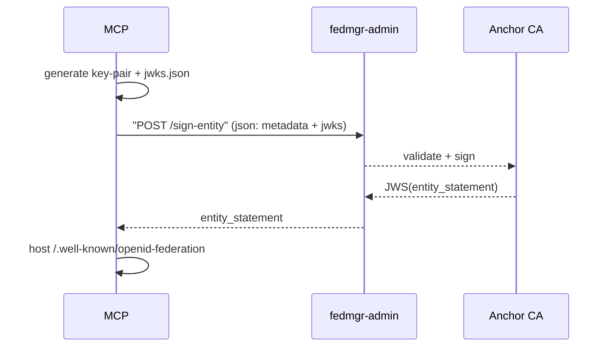

# Federation MCP Demo

This project demonstrates a federated MCP (Model Context Protocol) system with GitHub OAuth integration and OpenID Federation (OIDCFed) trust chains.

## Architecture direction

FedMgr is evolving from a Docker Compose demo into an OpenID Federation trust backplane for MCP. The refined MVP keeps the local demo simple while extracting a small operations library for trust-anchor creation, MCP server registration, entity-statement issuance, trust-mark evaluation, and gateway/plugin enforcement. See [OpenID Federation Trust Backplane MVP](docs/specs/openid-federation-trust-backplane-mvp.md) for the critique, target architecture, and rollout milestones.

### OpenID Federation + MCP trust backplane

FedMgr now converges on the TypeScript workspace architecture for OpenID Federation: `@letsfederate/kms` owns signing providers including OpenBao/Vault Transit, `@letsfederate/ta-server` owns entity and subordinate statement semantics, and `@letsfederate/fedmgr-mcp` exposes MCP-native provisioning and validation tools for Claude Code or any MCP harness. See [the convergence walkthrough](docs/walkthroughs/openid-ops-mcp-mvp.md), then run `npm run test:convergence` to verify OpenBao-backed signing and MCP endpoint-audience trust checks.

## Features

- 🔐 GitHub OAuth authentication
- 🛰️ Federation trust management
- 🤖 MCP server with federation JWT validation
- 🐳 Docker-based deployment
- 📊 Federation admin interface

## Prerequisites

- Docker and Docker Compose
- Node.js (for building npm packages)
- Git
- A GitHub account (for OAuth setup)

## Complete Setup Instructions

### 1. Clone and Navigate to Repository

```bash
git clone <repository-url>
cd <repository-name>
```

### 2. Setup GitHub OAuth App

1. Go to [GitHub Settings > Developer settings > OAuth Apps](https://github.com/settings/developers)
2. Click "New OAuth App"
3. Fill in the application details:
   - **Application name**: Federation MCP Demo (or your preferred name)
   - **Homepage URL**: `http://localhost:3006` (note: using port 3006 to avoid conflicts)
   - **Authorization callback URL**: `http://localhost:3006/oauth/callback`
4. Click "Register application"
5. Note down the **Client ID** and **Client Secret** from the app settings

### 3. Configure Environment Variables

```bash
# Copy the example environment file
cp .env.example .env

# Edit the .env file with your GitHub OAuth credentials
# Required variables:
# GITHUB_CLIENT_ID=your_github_client_id_here
# GITHUB_CLIENT_SECRET=your_github_client_secret_here
# FEDERATION_NAME=alpha (default, can be customized)
```

Example `.env` file:
```env
GITHUB_CLIENT_ID=Ov23abc123def456
GITHUB_CLIENT_SECRET=abc123def456ghi789jkl012mno345pqr678stu
FEDERATION_NAME=alpha
```

### 4. Run the Setup Script (Generates Keys & Default MCP)

`./scripts/setup.sh` is now required **before** any Docker builds. It prepares the
filesystem layout that is mounted into the containers and creates the default
federation and MCP instance.

```bash
# Build packages, generate keys, and scaffold default assets
./scripts/setup.sh
```

Running the setup script will:
1. Build the npm packages (`@letsfederate/fedmgr` and `@letsfederate/mcp-core`)
2. Generate federation keys and configuration under `build/install/`
3. Create the default MCP instance (`mcp-demo`) under `/usr/src/app/build/install/mcp_instances`
4. Clean up any existing containers and attempt to start the stack

After the script finishes (or after the build phase if you stop it before the
Docker step), verify that the following host directories now exist:

- `build/install/keys` – shared federation anchor keys copied into containers as `/usr/src/app/keys`
- `build/install/federations/<federation-name>` – federation configs copied to `/usr/src/app/federations`
- `build/install/fed-reg/registry.json` – registry copied to `/usr/src/app/data/registry.json`
- `/usr/src/app/build/install/mcp_instances/<instance-name>` – MCP runtime assets copied into the MCP container

> 💡 If you prefer to start Docker manually, run the setup script once to
> materialize these directories and then proceed with `docker-compose` commands.

### 5. Start the Federation System

```bash
# (Re)build images and start services after setup assets exist
docker-compose up --build -d
```

The containers expect the directories listed above to be present so that the
bootstrap process can mount/copy keys and registry data into `/usr/src/app` at
runtime.

### 6. Verify the System is Running

After the setup completes, you should see:

```
✅ Federation Admin is healthy
✅ MCP Server is healthy

🎉 Setup complete!

📖 Next steps:
   1. Open http://localhost:3006 in your browser
   2. Click 'Login with GitHub'
   3. Test the MCP API integration
```

## Container Ports

The system uses the following ports (configured to avoid common conflicts):

- **Federation Admin**: `http://localhost:3006` (external) → `3001` (internal)
- **MCP Server**: `http://localhost:4006` (external) → `4001` (internal)

## Troubleshooting

### Port Conflicts

If you encounter port binding errors, check what's using the ports:

```bash
# Check port usage
netstat -tlnp | grep -E ":(3006|4006)"

# Or use ss if netstat is not available
ss -tlnp | grep -E ":(3006|4006)"
```

To use different ports:
1. Edit `docker-compose.yml` and change the port mappings
2. Update the health check URLs in `scripts/setup.sh`
3. Update the OAuth callback URL in your GitHub app settings

### Missing Keys Error

If you see "Missing private key" errors:

```bash
# Regenerate keys
./scripts/setup-keys.sh alpha

# Restart containers
docker-compose down
docker-compose up -d
```

### Volume Mount Issues

If containers can't access keys:

```bash
# Fix permissions
sudo chown -R 1000:1000 ./build/install/

# Restart containers
docker-compose down
docker-compose up -d
```

### View Container Logs

```bash
# View all logs
docker-compose logs -f

# View specific service logs
docker-compose logs -f federation-admin
docker-compose logs -f mcp-server
```

### Missing `build/install` Assets

If the containers fail during bootstrap because `build/install/...` directories
are empty or missing:

```bash
# Re-run the setup script to regenerate keys, federation data, and MCP assets
./scripts/setup.sh

# After the assets exist, rebuild the containers
docker-compose down
docker-compose up --build -d
```

Double-check that the directories listed in the setup section are populated
before rebuilding the images.

## Manual Container Management

```bash
# Stop all services
docker-compose down

# Start services
docker-compose up -d

# Rebuild and start services
docker-compose up --build -d

# Check container status
docker-compose ps
```

# Refactor Opportunity



# Demo quickstart

- ./scripts/setup.sh

````mermaid
flowchart LR
    subgraph docker-compose
        direction LR
        FM[fedmgr container<br>• Anchor CA and Entity-Stmt<br>• Token-Exchange + AS]
        MCP[demo-mcp container<br>port 4001]
    end
    GH[GitHub OAuth IdP]
    VS[VS Code / curl API caller]
    FM -- "1️⃣ on start:<br/>generate anchor key & CA<br/>publish /.well-known" --> FM
    MCP -- "2️⃣ boot:<br/>fetch & verify FM entity stmt<br/>cache trust-marks" --> FM
    VS -. "3️⃣ browser to /login" .-> GH
    GH -- "4️⃣ user MFA & consent<br/>→ auth code" --> VS
    VS -->|"5️⃣ POST /callback<br/>auth code"| FM
    FM -- "6️⃣ token-exchange:<br/>ID-Token ⇒ JAG<br/>issue DPoP-bound JWT" --> VS
    VS -- "7️⃣ Authorization: Bearer <jwt><br/>DPoP: proof" --> MCP
    MCP -- "8️⃣ verify sig  trust-mark<br/>return protected response" --> VS
    ```
````
