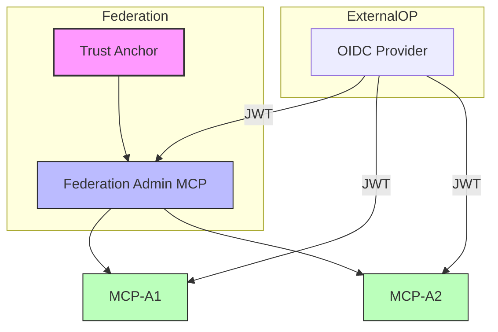

# fedctl# 🛰️ fedmgr – Federated Identity Orchestrator

`fedmgr` is tooling and orchestration engine for building , managing, and testing **identity federations** across **MCP servers**, **OIDC providers**, and **trust anchors**. 

Inspired by tools like `kubectl`, `vault`, or `terraform` ,  `fedmgr` provides a modern CLI + UI interface for federated identity experimentation and trust zone simulation.  

Capabilities:

- Bootstrap trust anchors
- Mint and manage federation metadata
- Spin up multiple federated MCPs dynamically
- Visualize trust relationships in real-time
- Simulate cross-federation identity flows
- Inspect telemetry of token validation and request activity

---
# Why?

Current MCP authorization techniques are lacklustre when it comes to scaling them up. 
Having each user  to be authorized to each service creates an N by M problem. N participants having to trust M endpoints so an big oh order of O(n*m). In other words, when 1 user needs M MCP endpoints each requiring authorization, it may suffer from misalignment of expiry of authorizations or a myriad other reasons. When 1 user changes to 10,000 or 1,000,000 this problem really reveals itself.

OIDC Federation's multi-lateral hierachical trust model avoids the N by M scaling problem.
The approach has only a fixed enrollment cost of Y effort 'to join the federation' which in turn will mean users who sign in will have been minted a credential already capable of participating in a trust model  **with an endpoint from within the OIDC federation**.

On scaling alone this is an order of O(Y) effort. Additional benefits are revocation / termination of a session can happen with low configuration effort and ensuring trust* across MCPs becomes a bit easier and not fragmented in authentication into each MCP  

**trust is a big topic and is the backlog to document practices as we use the technology.

## But is this practical?

Yes. 

Existing cases like R&E federation demonstrate that multi-lateral trust models scale to 1000's of endpoints of RP's and OP's. See edugain.org for the largest multi-lateral trust fabric. There the RPs are web based, and the advent or AI's MCP model means MCP are the new RPs.

Less talked about but of even more utility is the 'federation of one OP' or 'internal federation'.  
- even in R&E's model, campus' usually ahve 10x more services or endpoints internally than they export. They still want the benefit of multi-lateral federation. 
- The same for businesses and even more so (IMO).  Why force users to authorize at each endpoint when they can have their OIDC Federation minted token be effectively trusted and more easily managed?

# What's in this repo 

- The builder for the `fedmgr` NPM package
- Example(s) of the federation in action using a boilerplate docker environment of
  - mock OP, 
  - some other MCP's 
  - possibly a visual representation of the trust model

# 🧠 Architecture Overview


Each MCP can:

Validate tokens issued by trusted OIDC OPs

Confirm that the issuer is part of a known federation via metadata chaining

Emit structured telemetry to the fedmgr dashboard


# Quickstart

- build and locally install the NPM to access the NPX commands
- bootstrap a local federation that creates a trust anchor and registers a few MCP servers
- run the docker compose up -d to see it in action.


## 🧰 Core FedMgr Commands

You can use `fedmgr` through NPX without installing it globally:

```bash
# Using NPX (recommended)
npx @letsfederate/fedmgr create fed <federation-name>    # Bootstrap a new trust anchor and federation
npx @letsfederate/fedmgr create mcp <name>               # Spawn a new MCP instance and register with a federation
npx @letsfederate/fedmgr list entities                   # List all federated entities
npx @letsfederate/fedmgr visualize                       # Show trust graph and entity telemetry
npx @letsfederate/fedmgr call <mcp> --token <jwt>        # Simulate a call to an MCP with an OIDC token
```

This approach:
- Avoids global installation
- Prevents version conflicts
- Ensures you're always using the latest version


🗂️ Project Structure
```bash
fedmgr/
├── /src          → All source code (CLI + services)
│   ├── cli/      → Command handlers and core `fedmgr` logic
│   ├── server/   → MCP & Federation Admin microservices
│   └── web/      → Visualization interface (D3.js UI)
├── /public       → Static assets (favicon, fonts, etc.)
├── /docs         → Markdown specs, API contracts, trust formats
├── /scripts      → Startup scripts, bootstrap helpers
├── /test         → Unit + integration tests
├── /plans        → Planning and design (markdown directives)
│   ├── federation.md
│   ├── mcp-behavior.md
│   └── telemetry.md
└── README.md
```

📍 Status
-  Federation Admin server scaffolding
-  MCP telemetry via WebSocket
- Dynamic trust validation logic
- Visualization canvas via D3.js
- democtl commands for local orchestration

🔮 Future Enhancements
- Proxy OP support (Google/Azure → local federation)
 - Federation replay/simulation scripting
 - Multi-tenant sandboxing
-  JWE encryption + assurance tagging

## 🛠️ Requirements
- Node.js ≥ v18
- VSCode (for full developer UX)
- mkcert (optional, if using TLS locally)

## 📚 Documentation

### Core Documentation
- [Quickstart Guide](docs/quickstart.md) - Get started with fedmgr
- [Federation Manager Quickstart](docs/fedmgr-quickstart.md) - Detailed guide for using the fedmgr CLI
- [NPX Usage Guide](docs/npx-usage-guide.md) - How to use fedmgr with NPX
- [Architecture Overview (April 2025)](docs/architecture-april2025.md) - System architecture and components
- [Certificate Handling](docs/certificate-handling.md) - How certificates are managed in the federation

### Specifications
- [Federation Manager Specification](docs/specs/fedmgr-spec.md) - Detailed specification for the fedmgr component
- [MCP Core Specification](docs/specs/mcp-core-spec.md) - Specification for the MCP core component
- [NPX Improvement Specification](docs/specs/improvement-add-npx.md) - Specification for NPX capabilities

### Examples and Testing
- [Example Test Run](docs/example-01-testrun.md) - Example of a test run
- [Testing Documentation](docs/testing.md) - How to test the system
