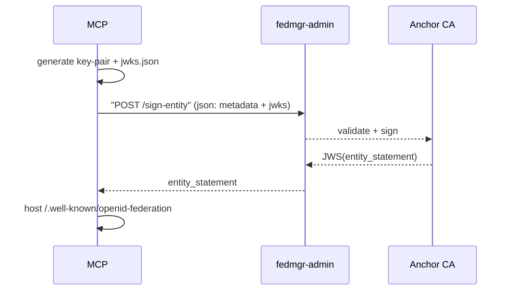

# Federation MCP Demo

This project demonstrates a federated MCP (Model Context Protocol) system with GitHub OAuth integration and OpenID Federation (OIDCFed) trust chains.

## Features

- 🔐 GitHub OAuth authentication
- 🛰️ Federation trust management
- 🤖 MCP server with federation JWT validation
- 🐳 Docker-based deployment
- 📊 Federation admin interface

## Quick Start

1. **Setup GitHub OAuth App**
   - Go to GitHub Settings > Developer settings > OAuth Apps
   - Create new OAuth app with callback URL: `http://localhost:3001/oauth/callback`
   - Note the Client ID and Client Secret

2. **Configure Environment**
   ```bash
   cp .env.example .env
   # Edit .env with your GitHub OAuth credentials
   ```

# Refactor Opportunity



# Demo quickstart
- ./scripts/setup.sh

```mermaid
flowchart LR
    subgraph docker-compose
        direction LR
        FM[fedmgr container<br>• Anchor CA and Entity-Stmt<br>• Token-Exchange + AS]
        MCP[demo-mcp container<br>port 4001]
    end
    GH [GitHub OAuth<br/>IdP]
    VS [VS Code / curl<br/>API caller]
    FM -- "1️⃣ on start:<br/>generate anchor key & CA<br/>publish /.well-known" --> FM
    MCP -- "2️⃣ boot:<br/>fetch & verify FM entity stmt<br/>cache trust-marks" --> FM
    VS -. "3️⃣ browser to /login" .-> GH
    GH -- "4️⃣ user MFA & consent<br/>→ auth code" --> VS
    VS -->|"5️⃣ POST /callback<br/>auth code"| FM
    FM -- "6️⃣ token-exchange:<br/>ID-Token ⇒ JAG<br/>issue DPoP-bound JWT" --> VS
    VS -- "7️⃣ Authorization: Bearer <jwt><br/>DPoP: proof" --> MCP
    MCP -- "8️⃣ verify sig  trust-mark<br/>return protected response" --> VS
    ```