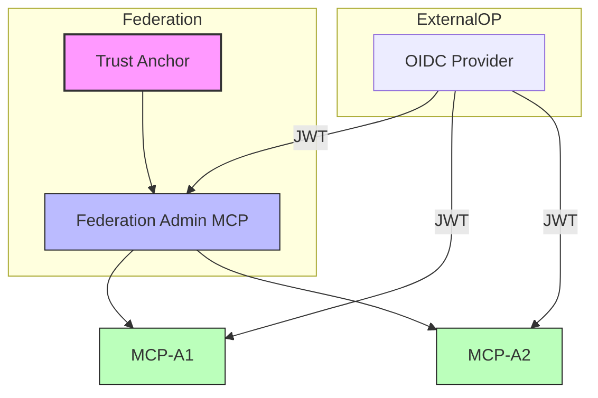

# fedctl# 🛰️ fedmgr – Federated Identity Orchestrator

`fedmgr` is tooling and orchestration engine for building, managing, and testing **identity federations** across **MCP servers**, **OIDC providers**, and **trust anchors**.

Inspired by tools like `kubectl`, `vault`, and `terraform`, `fedmgr` provides a modern CLI + UI interface for federated identity experimentation and trust zone simulation.

It enables you to:

- Bootstrap trust anchors
- Mint and manage federation metadata
- Spin up multiple federated MCPs dynamically
- Visualize trust relationships in real-time
- Simulate cross-federation identity flows
- Inspect telemetry of token validation and request activity

---
# Why?
OIDC Federation technology offers more scaleable trust than the current MCP bilateral model.

Current MCP authorization techniques where each user has to be authorized to each service creates an N by M problem;  N participants having to trust M endpoints so an big oh order of O(n*m). It scales poorly when 1 user needs M MCP endpoints each requiring authorization, which of course may not align in expiry or other reasons.

OIDC Federation's multi-lateral hierachical trust model scales much better. There is a fixed enrollment cost of Y effort 'to join the federation' and the user when they sign in is already authorized  **with an endpoint from within the OIDC federation** thus an order of O(Y) effort. Additional benefits are that revocation / termination of a session in synonmous across all location where employed and not fragmented in authentication into each MCP  

## But is it practical?

Yes. Existing cases like R&E federation demonstrate the scale.  

Less talked about but of even more utility is the 'federation of one OP' or 'internal federation'.  
- A campus has 10x more services or endpoints internally than they export and still want to the same benefit from federation. 
- The same for businesses.  Why force users to authorize at each endpoint when they can have their OIDC Federation minted token be effectively trusted and more easily managed?

## What this repo does

- is the starting home for the `fedmgr` NPX package
- has an example federation to demonstrate the benefits and limitations of the solution


## 🧰 Core FedMgr Commands

You can use `fedmgr` through NPX without installing it globally:

```bash
# Using NPX (recommended)
npx @letsfederate/fedmgr create fed <federation-name>    # Bootstrap a new trust anchor and federation
npx @letsfederate/fedmgr create mcp <name>               # Spawn a new MCP instance and register with a federation
npx @letsfederate/fedmgr list entities                   # List all federated entities
npx @letsfederate/fedmgr visualize                       # Show trust graph and entity telemetry
npx @letsfederate/fedmgr call <mcp> --token <jwt>        # Simulate a call to an MCP with an OIDC token
```

This approach:
- Avoids global installation
- Prevents version conflicts
- Ensures you're always using the latest version

🧠 Architecture Overview


Each MCP can:

Validate tokens issued by trusted OIDC OPs

Confirm that the issuer is part of a known federation via metadata chaining

Emit structured telemetry to the fedmgr dashboard

🗂️ Project Structure
```bash
fedmgr/
├── /src          → All source code (CLI + services)
│   ├── cli/      → Command handlers and core `fedmgr` logic
│   ├── server/   → MCP & Federation Admin microservices
│   └── web/      → Visualization interface (D3.js UI)
├── /public       → Static assets (favicon, fonts, etc.)
├── /docs         → Markdown specs, API contracts, trust formats
├── /scripts      → Startup scripts, bootstrap helpers
├── /test         → Unit + integration tests
├── /plans        → Planning and design (markdown directives)
│   ├── federation.md
│   ├── mcp-behavior.md
│   └── telemetry.md
└── README.md
```

📍 Status
-  Federation Admin server scaffolding
-  MCP telemetry via WebSocket
- Dynamic trust validation logic
- Visualization canvas via D3.js
- democtl commands for local orchestration

🔮 Future Enhancements
- Proxy OP support (Google/Azure → local federation)
 - Federation replay/simulation scripting
 - Multi-tenant sandboxing
-  JWE encryption + assurance tagging

## 🛠️ Requirements
- Node.js ≥ v18
- VSCode (for full developer UX)
- mkcert (optional, if using TLS locally)

## 📚 Documentation

### Core Documentation
- [Quickstart Guide](docs/quickstart.md) - Get started with fedmgr
- [Federation Manager Quickstart](docs/fedmgr-quickstart.md) - Detailed guide for using the fedmgr CLI
- [NPX Usage Guide](docs/npx-usage-guide.md) - How to use fedmgr with NPX
- [Architecture Overview (April 2025)](docs/architecture-april2025.md) - System architecture and components
- [Certificate Handling](docs/certificate-handling.md) - How certificates are managed in the federation

### Specifications
- [Federation Manager Specification](docs/specs/fedmgr-spec.md) - Detailed specification for the fedmgr component
- [MCP Core Specification](docs/specs/mcp-core-spec.md) - Specification for the MCP core component
- [NPX Improvement Specification](docs/specs/improvement-add-npx.md) - Specification for NPX capabilities

### Examples and Testing
- [Example Test Run](docs/example-01-testrun.md) - Example of a test run
- [Testing Documentation](docs/testing.md) - How to test the system
