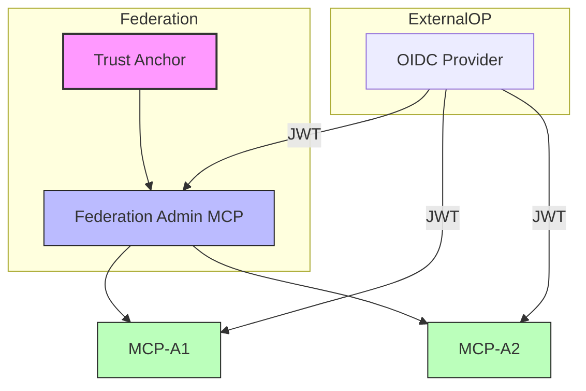

# fedctl# 🛰️ fedmgr – Federated Identity Orchestrator

`fedmgr` is a developer tool and orchestration engine for building, managing, and testing **identity federations** across **MCP servers**, **OIDC providers**, and **trust anchors**.

It enables you to:

- Bootstrap trust anchors
- Mint and manage federation metadata
- Spin up multiple federated MCPs dynamically
- Visualize trust relationships in real-time
- Simulate cross-federation identity flows
- Inspect telemetry of token validation and request activity

Inspired by tools like `kubectl`, `vault`, and `terraform`, `fedmgr` provides a modern CLI + UI interface for federated identity experimentation and trust zone simulation.

---

## 🧰 Core Commands

```bash

fedmgr create fed <federation-name>          # Bootstrap a new trust anchor and federation
fedmgr create mcp <name>                     # Spawn a new MCP instance and register with a federation
fedmgr list entities                         # List all federated entities
fedmgr visualize                             # Show trust graph and entity telemetry
fedmgr call <mcp> --token <jwt>              # Simulate a call to an MCP with an OIDC token

```

🧠 Architecture Overview


Each MCP can:

Validate tokens issued by trusted OIDC OPs

Confirm that the issuer is part of a known federation via metadata chaining

Emit structured telemetry to the fedmgr dashboard

🗂️ Project Structure
bash
Copy
Edit
fedmgr/
├── /src          → All source code (CLI + services)
│   ├── cli/      → Command handlers and core `fedmgr` logic
│   ├── server/   → MCP & Federation Admin microservices
│   └── web/      → Visualization interface (D3.js UI)
├── /public       → Static assets (favicon, fonts, etc.)
├── /docs         → Markdown specs, API contracts, trust formats
├── /scripts      → Startup scripts, bootstrap helpers
├── /test         → Unit + integration tests
├── /plans        → Planning and design (markdown directives)
│   ├── federation.md
│   ├── mcp-behavior.md
│   └── telemetry.md
└── README.md
📍 Status
-  Federation Admin server scaffolding
-  MCP telemetry via WebSocket
- Dynamic trust validation logic
- Visualization canvas via D3.js
- democtl commands for local orchestration

🔮 Future Enhancements
- Proxy OP support (Google/Azure → local federation)
 - Federation replay/simulation scripting
 - Multi-tenant sandboxing
-  JWE encryption + assurance tagging

🛠️ Requirements
- Node.js ≥ v18
- VSCode (for full developer UX)
- mkcert (optional, if using TLS locally)
