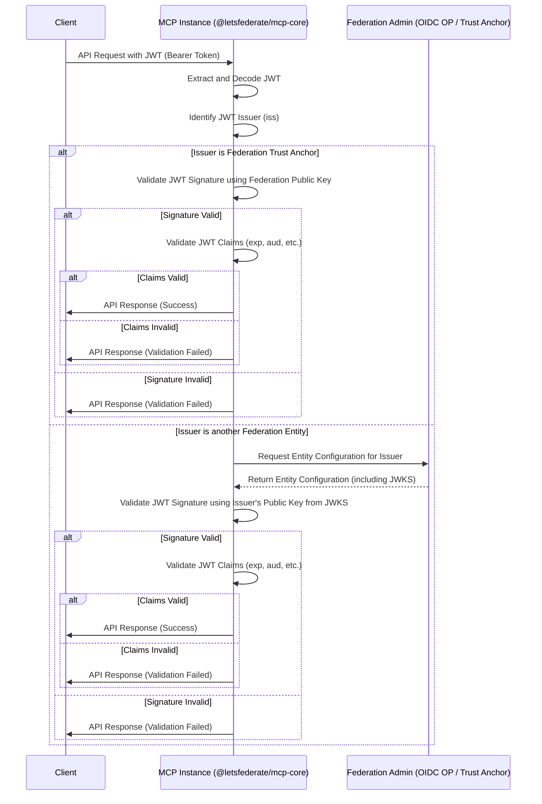

# 🏛️ fedmgr Project Architecture (April 2025)

TODO: This document needs refinement per ./plans/arch-codereview-20250620.md and ./plans/arch-prd-chatgpt-candidate-20250620.md as this document is moderately accurate but not current to the code base in ./src and the docker-compose.yml file and supporting ./scripts/**.sh


This document provides a high-level overview of the `fedmgr` project architecture as of April 2025. It aims to be a comprehensive, succinct, and informative guide for understanding the system's purpose, key components, interactions, and deployment structure.

## 1. Project Overview

The `fedmgr` project is designed to manage and facilitate interactions within a federated environment based on the Metadata Conditional Publication (MCP) protocol. It provides tools for bootstrapping and managing federation entities and MCP instances, as well as a core runtime for MCP servers that handle identity, trust, and data publication.

Key components include:

*   **`@letsfederate/mcp-core`**: The core NPM package implementing the MCP server runtime and its API endpoints (`/whoami`, `/showtrust`, `/stats`, `/status`). It handles JWT validation against a federation trust chain.
*   **`@letsfederate/fedmgr`**: The NPM package providing a Command Line Interface (CLI) and library for creating, configuring, and managing federations and MCP instances.
*   **OIDC OP (OpenID Connect Identity Provider)**: An external component (simulated by `sphereon/oidc-federation-op`) that acts as an Identity Provider within the federation, potentially issuing JWTs that MCPs need to validate.
*   **Federation Trust Anchor**: The root of trust for a federation. In this project, it's represented by the entity configuration and public/private keys managed by the `fedmgr` CLI and used by the Federation Admin service.

## 2. MCP Call Process Flow

The following diagram illustrates a simplified flow of an MCP API call involving JWT validation against the federation trust chain:



In a real-world scenario, the MCP might need to fetch the issuer's entity configuration and potentially traverse a trust chain back to the Federation Trust Anchor to fully validate the JWT. The current implementation in `mcp-core` includes a simplified validation against a known federation public key.

## 3. Docker Compose Container Layout

The `docker-compose.generated.yml` file defines the multi-container Docker environment for the fedmgr project. It orchestrates the following services:

```mermaid
graph TD
    subgraph Network [federated_net]
        OIDC_OP[oidc-op sphereon/oidc-federation-op]
        FEDMGR[fedmgr Custom Dockerfile]
        MCP1[mcp-1: Custom Dockerfile]
        MCP2[mcp-2: Custom Dockerfile]
        MCP3[mcp-3: Custom Dockerfile]
    end

    OIDC_OP -- Exposes 3000 --> Host(Host Machine)
    MCP1 -- Exposes 4001 --> Host
    MCP2 -- Exposes 4002 --> Host
    MCP3 -- Exposes 4003 --> Host

    FEDMGR -- Mounts ./federations --> FEDMGR_VOL(Container /app/federations)
    FEDMGR -- Mounts ./mcp_instances --> FEDMGR_MCP_VOL(Container /app/mcp_instances)

    MCP1 -- Mounts ./data --> MCP1_DATA_VOL(Container /app/data)
    MCP1 -- Mounts ./mcp_instances/mcp-1 --> MCP1_CONFIG_VOL(Container /app/mcp_instances/mcp-1)

    MCP2 -- Mounts ./data --> MCP2_DATA_VOL(Container /app/data)
    MCP2 -- Mounts ./mcp_instances/mcp-2 --> MCP2_CONFIG_VOL(Container /app/mcp_instances/mcp-2)

    MCP3 -- Mounts ./data --> MCP3_DATA_VOL(Container /app/data)
    MCP3 -- Mounts ./mcp_instances/mcp-3 --> MCP3_CONFIG_VOL(Container /app/mcp_instances/mcp-3)

    OIDC_OP --> FEDMGR:Configuration_via_Volumes
    FEDMGR --> MCP1:Configuration_via_Volumes
    FEDMGR --> MCP2:Configuration_via_Volumes
    FEDMGR --> MCP3:Configuration_via_Volumes
    MCP1 --> MCP2:MCP_Protocol_Interaction_(via_network)
    MCP1 --> MCP3:MCP_Protocol_Interaction_(via_network)
    MCP2 --> MCP1:MCP_Protocol_Interaction_(via_network)
    MCP2 --> MCP3:MCP_Protocol_Interaction_(via_network)
    MCP3 --> MCP1:MCP_Protocol_Interaction_(via_network)
    MCP3 --> MCP2:MCP_Protocol_Interaction_(via_network)
    OIDC_OP --> MCP1:Federation_Interaction_(via network)
    OIDC_OP --> MCP2:Federation_Interaction_(via network)
    OIDC_OP --> MCP3:Federation_Interaction_(via network)
```



*   **oidc-op**: Runs the OIDC Federation OP image, exposing port 3000. Configuration is mounted from `./config/oidc-op`.
*   **fedmgr**: Built from `Dockerfile.fedmgr`, mounts `./federations` and `./mcp_instances` for managing federation and MCP configurations.
*   **mcp-1, mcp-2, mcp-3**: Each built from `Dockerfile.mcp-core`, exposing different ports (4001, 4002, 4003) mapped to container port 3000. They mount `./data` for persistent storage and their specific instance configuration from `./mcp_instances/`.
*   **federated_net**: A bridge network allowing all services to communicate with each other using their service names.

## 4. NPM Package Integration and Execution Models

### 4.1 Docker Integration

The `Dockerfile.fedmgr` and `Dockerfile.mcp-core` demonstrate how the local NPM packages (`@letsfederate/fedmgr` and `@letsfederate/mcp-core`) are integrated into their respective Docker containers.

The process involves:

1.  Starting from a Node.js base image (`node:22-alpine`).
2.  Setting the working directory to `/app`.
3.  Copying the packaged `.tgz` file of the respective NPM package (e.g., `fedmgr-*.tgz`, `mcp-core-*.tgz`) into the container's `/app` directory. This assumes the packages have been built and packaged locally before the Docker build.
4.  Using `npm install ./package-name-*.tgz` to install the local package within the container. This makes the package's executables and libraries available inside the container.
5.  Defining the `CMD` to run the main script of the installed package (e.g., `node node_modules/@letsfederate/fedmgr/dist/cli/fedmgr.js`).

This approach ensures that the Docker images are built with the specific versions of the local packages, making the containers self-contained and portable.

### 4.2 NPX Execution Model

The `@letsfederate/fedmgr` package is designed to be executable via NPX, allowing users to run the CLI without requiring a global installation:

```bash
npx @letsfederate/fedmgr <command>
```

This execution model works through the following mechanism:

1. The package's `package.json` includes a `bin` field that maps the command name `fedmgr` to the CLI entry point script:
   ```json
   "bin": {
     "fedmgr": "./src/cli/fedmgr.js"
   }
   ```

2. The CLI entry point script (`src/cli/fedmgr.js`) includes a shebang line (`#!/usr/bin/env node`) that tells the system to execute it using Node.js.

3. When a user runs `npx @letsfederate/fedmgr`, NPX:
   - Downloads the package temporarily (if not already installed)
   - Identifies the binary defined in the `bin` field
   - Makes it executable
   - Runs it with the provided arguments

This approach offers several advantages:
- Users don't need to install the package globally
- It prevents version conflicts between different projects
- It ensures users always run the latest version
- It simplifies the setup process for new users

The NPX execution model is particularly well-suited for the `fedmgr` CLI, which is primarily used for management and bootstrapping tasks rather than as a runtime dependency.

## 5. Configuration Management

Configuration in the fedmgr project is primarily managed through **environment variables** and **mounted volumes**, adhering to the principle of not hardcoding sensitive information or environment-specific values.

*   **Environment Variables**: Used to configure application settings such as network ports (`PORT`, `MCP_PORT`), hostnames (`MCP_HOST`), entity identifiers (`MCP_ID`), and critical file paths (`FEDMGR_FEDERATIONS_DIR`, `FEDMGR_MCP_INSTANCES_DIR`, `TRUST_STORE_PATH`, `STATS_STORAGE_PATH`, `MCP_CONFIG_PATH`). These are defined in the `docker-compose.generated.yml` and read by the application code (e.g., via a configuration module or `dotenv`).
*   **Mounted Volumes**: Used to inject configuration files (like `entity-configuration.json`) and provide persistent storage for data (like trust stores and statistics) into the containers. Volumes map directories from the host machine (e.g., `./federations`, `./mcp_instances`, `./data`) to specific paths within the container (`/app/federations`, `/app/mcp_instances`, `/app/data`). This allows configuration and data to persist outside the container lifecycle and be easily managed on the host.

This configuration strategy promotes flexibility, allowing the same Docker images to be used in different environments by simply changing the environment variables and the content of the mounted volumes.