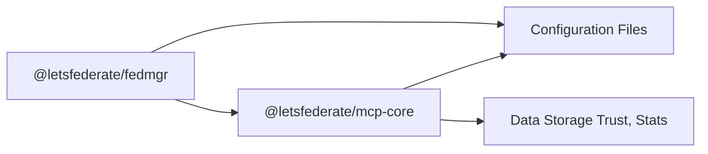
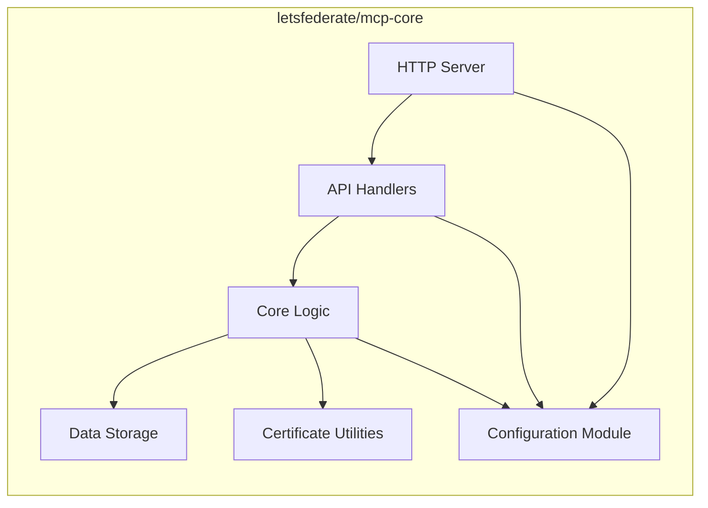
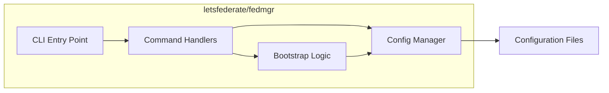
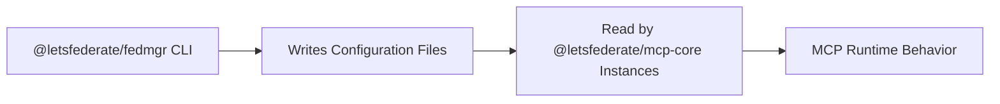

# 🏛️ Updated Project Architecture: `fedmgr` and `mcp-core`

This document outlines the updated architecture for the `fedmgr` project, incorporating the specifications for the `@letsfederate/mcp-core` and `@letsfederate/fedmgr` NPM packages. The architecture emphasizes modularity, clear responsibilities, and well-defined interfaces for scalable and maintainable federation management.

## 📦 Component Architecture

The project is primarily composed of two distinct NPM packages:

1.  **`@letsfederate/mcp-core`**: This package provides the core MCP server runtime and API.
2.  **`@letsfederate/fedmgr`**: This package provides the CLI and library for bootstrapping and managing federations and MCP configurations.

## `@letsfederate/mcp-core` Architecture

The `@letsfederate/mcp-core` package is an Express-based HTTP server with a modular structure:

*   **HTTP Server (`mcp-server.js`)**: Manages the server lifecycle and routes incoming requests.
*   **API Handlers (`api-handlers.js`)**: Implement the logic for the `/whoami`, `/showtrust`, `/stats`, and `/status` endpoints.
*   **Core Logic (`core-logic.js`)**: Contains the fundamental business logic for identity, trust, statistics, and status.
*   **Data Storage**: Represents modules for persistent storage of trust relationships and statistics.
*   **Certificate Utilities**: Modules for handling cryptographic operations and certificate management.
*   **Configuration Module (`config.js`)**: Centralized handling of environment-based configuration.

### API Contracts and Data Flow

The `@letsfederate/mcp-core` exposes the following GET endpoints:

*   **`/whoami`**: Returns MCP identity information (ID, public key, endpoint URLs).
    *   **Data Flow**: Request -> API Handler -> Core Logic (get identity) -> Response.
*   **`/showtrust`**: Returns a list of trusted entities.
    *   **Data Flow**: Request -> API Handler -> Core Logic (get trust data) -> Data Storage -> Response.
*   **`/stats`**: Returns operational statistics.
    *   **Data Flow**: Request -> API Handler -> Core Logic (get stats) -> Data Storage -> Response.
*   **`/status`**: Returns the operational status of the MCP and its components.
    *   **Data Flow**: Request -> API Handler -> Core Logic (check status) -> Checks on dependencies (Data Storage, etc.) -> Response.

All responses are in JSON format. Errors are returned with an `errorCode` and `errorMessage`.

## `@letsfederate/fedmgr` Architecture

The `@letsfederate/fedmgr` package provides the command-line interface for managing the federation:

*   **CLI Entry Point (`cli.js`)**: Parses arguments and dispatches commands.
*   **Command Handlers**: Modules for specific commands (`create`, `delete`, `help`).
*   **Config Manager (`config-manager.js`)**: Handles reading, writing, and managing federation and MCP configuration files.
*   **Bootstrap Logic (`bootstrap-logic.js`)**: Implements the logic for setting up new federations, generating keys, etc.

### CLI Command Interfaces and Data Flow

The `fedmgr` CLI provides commands for creating and deleting federation entities:

*   **`fedmgr create fed <name>`**: Creates a new federation configuration.
    *   **Data Flow**: CLI -> Create Command Handler -> Bootstrap Logic (generate keys, config) -> Config Manager (write files) -> Configuration Files.
*   **`fedmgr create op <name> --federation <fed_name>`**: Creates a new operator configuration within a federation.
    *   **Data Flow**: CLI -> Create Command Handler -> Config Manager (read fed config) -> Bootstrap Logic (generate keys, update config) -> Config Manager (write fed config).
*   **`fedmgr create mcp <name>`**: Creates a new MCP configuration.
    *   **Data Flow**: CLI -> Create Command Handler -> Config Manager (write mcp config) -> Configuration Files.
*   **`fedmgr delete fed <name>`**: Deletes a federation configuration.
    *   **Data Flow**: CLI -> Delete Command Handler -> Config Manager (delete files) -> Configuration Files.
*   **`fedmgr help [command]`**: Displays help information.
    *   **Data Flow**: CLI -> Help Command Handler -> Output help text.

Configuration file paths are managed via environment variables (`FEDMGR_FEDERATIONS_DIR`, `FEDMGR_MCP_INSTANCES_DIR`).

## Integration Points

The two packages integrate primarily through the configuration files. The `fedmgr` CLI generates and manages these files, which are then read by the `@letsfederate/mcp-core` instances to configure their behavior, trust relationships, and identity.

Environment variables are used consistently across both packages for configurable paths and core MCP identity/endpoint information, preventing hard-coded values.

## Environment Variable Management

Both packages rely on environment variables for configuration. A dedicated configuration module within each package is responsible for reading and validating these variables, ensuring no secrets or configuration are hard-coded.

*   `@letsfederate/mcp-core`: `MCP_PORT`, `MCP_HOST`, `MCP_ID`, `MCP_PUBLIC_KEY`, `MCP_BASE_URL`, `TRUST_STORE_PATH`, `STATS_STORAGE_PATH`.
*   `@letsfederate/fedmgr`: `FEDMGR_FEDERATIONS_DIR`, `FEDMGR_MCP_INSTANCES_DIR`.

This approach promotes flexibility and allows for easy deployment and configuration in different environments.

## Future Extensibility

The modular design of both packages allows for future extensions, such as:

*   Adding support for different trust store implementations.
*   Integrating with various identity providers beyond the current OIDC Federation focus.
*   Developing new CLI commands for advanced management tasks.
*   Implementing alternative data storage solutions for statistics and trust data.