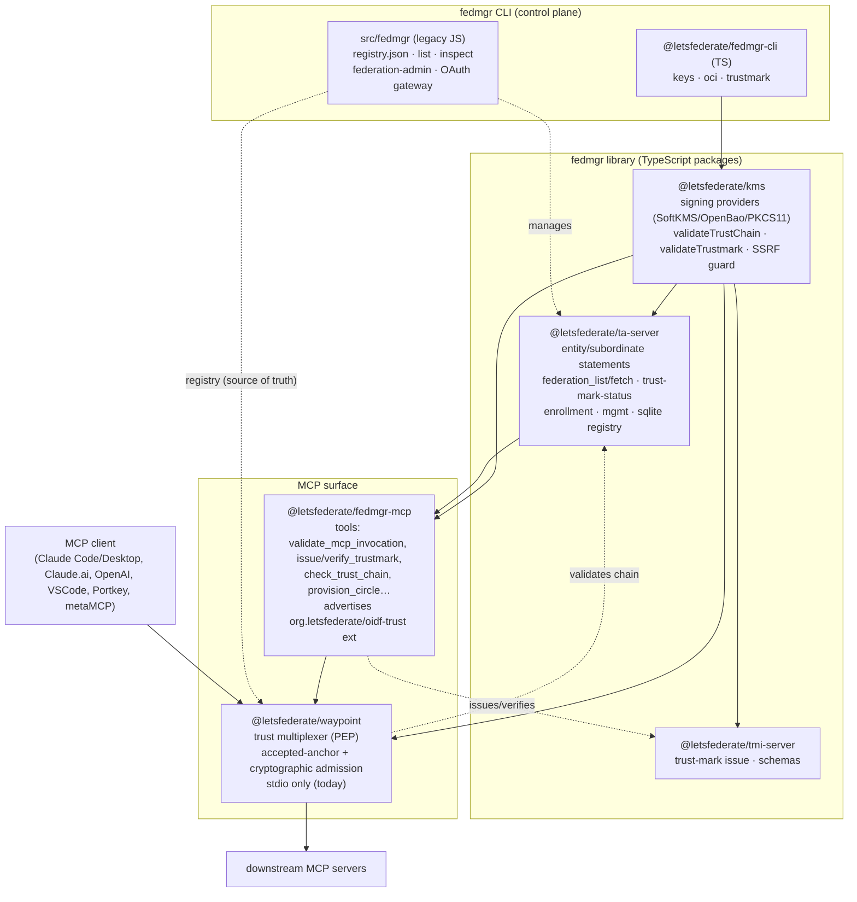
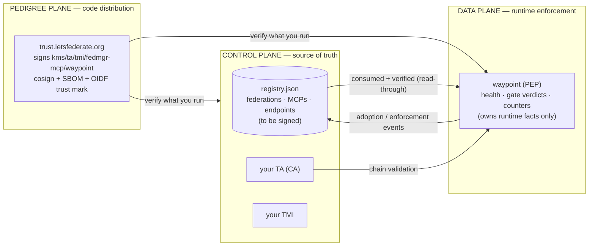
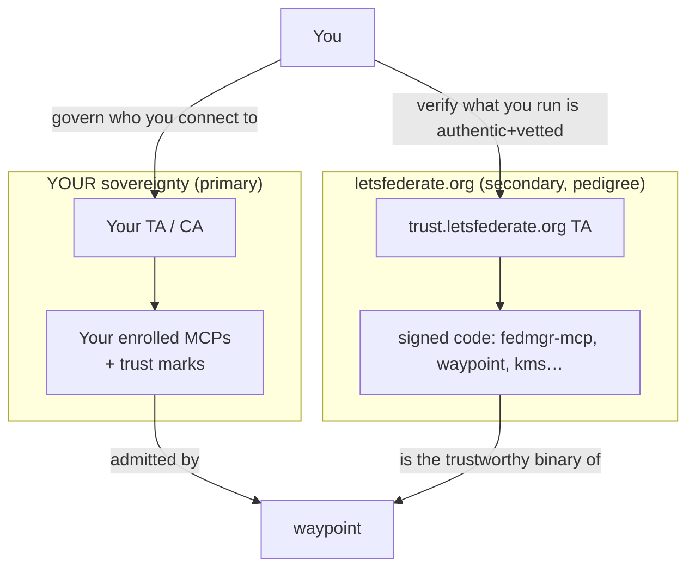
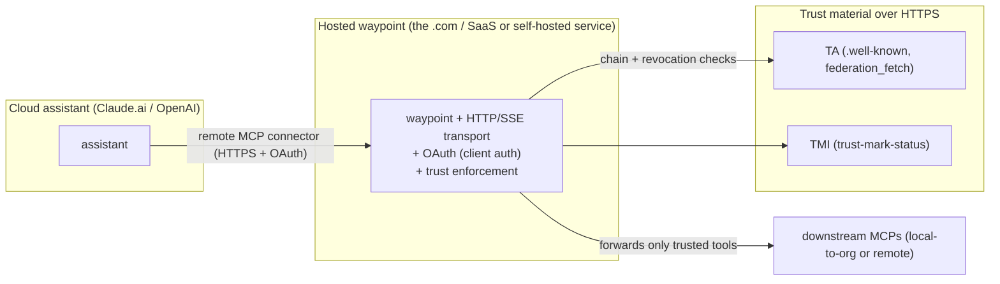
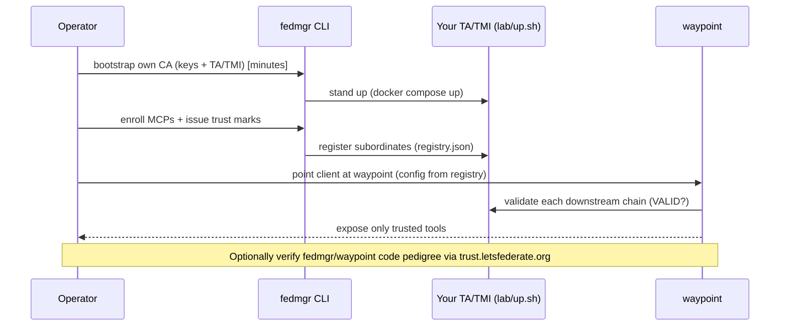

# fedmgr / waypoint Trust Fabric — Architecture & Coverage Assessment

> Status: **DRAFT for review** (rendered on the LAN before commit). Assessment date 2026-06-14.
> Coverage %s are engineering estimates (assessment, not measured), with rationale.

## 0. Executive summary

A trust fabric for the MCP ecosystem, in three planes:

- **Control plane — `fedmgr`** (CLI + library + TA/TMI servers): the **source of truth**.
  Operators run their **own Trust Anchor (CA)**, enroll MCP servers, issue trust marks,
  and keep the canonical registry (federations, MCPs, endpoints).
- **Data plane — `waypoint`**: a runtime **trust multiplexer**. The client points at *one*
  MCP (waypoint); it connects to N downstream MCPs, admits only those that pass the
  accepted-anchor policy **and** cryptographically resolve a VALID trust chain, and exposes
  only their tools. It **consumes** the control plane's truth; it does not redefine it.
- **Pedigree / distribution plane — `trust.letsfederate.org`**: signs the **code components**
  we ship (kms, ta-server, tmi-server, fedmgr-mcp, waypoint) so a user can verify the
  *pedigree* of the software they run (cosign + SBOM + an OIDF trust mark), independent of
  who they trust at runtime.

- **Identity plane — OAuth/OIDC (peer of the data plane)**: inbound human/agent **sign-in** (GitHub in our
  base example; any OIDC IdP — Google/Okta/Entra). This is **not** OpenID Federation. Required to reach
  waypoint over HTTP/SSE; skipped for local stdio.

**The pivot:** signing *into* waypoint is plain **OAuth/OIDC**; the moment waypoint turns *downstream* it
**becomes OpenID Federation** (chain validation + trust marks). Inbound = identity, outbound = federation,
waypoint is the boundary. This makes the cloud/web work one bundle: a remote transport (Streamable HTTP/SSE)
**plus** an OAuth edge (reuse the GitHub/token-exchange bones in `src/fedmgr`). See the interactive
`trust-fabric.html`.

**Two orthogonal trust axes (the conceptual crux):**

| Axis | Authority | Question it answers |
|---|---|---|
| **Runtime trust** (who I connect to) | **Your own CA** (primary — agency/control) | "Is this MCP allowed in *my* circle?" |
| **Code pedigree** (what I run) | **trust.letsfederate.org** (secondary) | "Is this fedmgr/waypoint binary authentic and vetted?" |

You can self-host your CA and *also* verify our code's pedigree — they don't conflict.

---

## 1. Component & dependency diagram

**Critical key components**

| Component | Role | Plane | Status |
|---|---|---|---|
| `kms` | signing, chain/trustmark validation, SSRF guard | lib | mature, tested |
| `ta-server` | Trust Anchor: statements, federation_list/fetch, enrollment, registry | control | substantial |
| `tmi-server` | Trust Mark Issuer | control | substantial |
| `fedmgr-cli` (TS) | keys / OCI / trustmark signing | control | partial |
| `src/fedmgr` (JS) | **canonical registry**, list/inspect, OAuth gateway | control | legacy, owns truth |
| `fedmgr-mcp` | MCP tools + `oidf-trust` extension (patient zero) | data/MCP | working |
| `waypoint` | runtime trust multiplexer / PEP | data | **stdio only**, no status/registry-hydration |

---

## 2. The three planes (and where trust truth lives)

Decision (panel-reviewed): **fedmgr owns trust topology; waypoint is a runtime view, never a
second registry.** Sign `registry.json`; waypoint verifies on load and drift-checks
declared-vs-enforced, fail-closed. Adopted foreign TAs + audit live in the control-plane
registry (the ledger), not in waypoint.

## 3. Two trust roles — your CA vs our code-signing

You get **agency** (your CA decides your circle) *and* **pedigree** (our signing proves the
gateway you run wasn't tampered). Bootstrap your own in minutes, or adopt
`trust.letsfederate.org` for the code-pedigree round trip — or both.

---

## 4. Audience / deployment matrix

| Audience | Where waypoint runs | Transport | How it fetches trust material | Client enforces ext? | Today |
|---|---|---|---|---|---|
| **Local individual** | on the dev's machine | **stdio** ✅ | local TA/TMI over HTTP, or `trust.letsfederate.org` over HTTPS | no (gateway enforces) | works |
| **Local power user + MCP** | local, added to Claude Code/Desktop | **stdio** ✅ | same | no | works |
| **Cloud / web (Claude.ai, OpenAI)** ⭐ | **hosted/remote service** | **HTTP/SSE (Streamable HTTP)** ❌ not built | hosted waypoint pulls TA/TMI over HTTPS | n/a — **waypoint IS the connector** | **gap** |
| **Enterprise / VSCode managed** | per-dev local *or* shared hosted | stdio (local) / HTTP (shared) | central org TA; config pushed via MDM | no | partial |
| **Aggregators (Portkey/metaMCP)** | as middleware in the aggregator | aggregator-native | aggregator calls our policy/validators | no | not integrated |

**Key insight for "who supports MCP extensions":** clients largely **don't act on custom
extensions** (the SDK strips them). So trust is **never** client-enforced today — it's enforced
at **waypoint** (the thing the client connects to) using the control-plane registry + chain
validation. For cloud/web this is actually *cleaner*: the assistant adds the **hosted waypoint
as its (remote) MCP connector**, so waypoint enforces trust regardless of client support.

## 5. Cloud / web deep dive (the priority gap)

**What's missing to serve cloud/web:**
1. **A remote transport for waypoint** — Streamable HTTP / SSE server (the SDK supports it; we
   only wired stdio). *Biggest single blocker.*
2. **Auth at the edge** — OAuth/bearer so the cloud assistant authenticates to the hosted
   waypoint (we have OAuth bones in `src/fedmgr`/token-exchange to reuse).
3. **A hosted deployment** — waypoint as a service (container) reachable over HTTPS (the
   Phase 7 `.com` model). Trust material is already HTTP-served, so this is reachable.
4. **Multi-tenant trust** — per-tenant accepted anchors / registry view.

Good news: because waypoint *is* the connector the cloud adds, **none of this depends on the
assistant supporting our MCP extension** — it sidesteps the extension-support problem entirely.

## 6. Deployment models & bootstrap

- **Self-host (primary):** `./examples/lab/up.sh` → your TA/TMI/registry in minutes; full agency.
- **Trust-our-pedigree (secondary):** verify the signed components you run against
  `trust.letsfederate.org` (cosign + trust mark) — independent of runtime trust.
- **Enterprise:** central org TA; managed/MDM config pins clients to waypoint; signed registry
  distributed; hundreds of devs get the same circle without hand-config.
- **Aggregator:** ship the trust policy (`evaluateOidfTrust` + chain validation) as a module
  that drops into Portkey/metaMCP middleware.

---

## 7. Coverage — Matrix A (per component)

| Component | % done | Rationale / gap |
|---|---:|---|
| `kms` (signing, validators, SSRF) | **85%** | SoftKMS/OpenBao + chain/trustmark validation tested; PKCS11 stub, no Cloud-KMS provider |
| `ta-server` | **75%** | statements, federation_list/fetch, trust-mark-status, enrollment, mgmt, sqlite; bootstrap fragility, no signed registry export |
| `tmi-server` | **70%** | issue + schemas + status; adoption/revocation lifecycle thin |
| `fedmgr-mcp` (+ oidf-trust ext) | **70%** | tools incl. validate_mcp_invocation + extension + OTel; extension not client-enforceable |
| `fedmgr-cli` (TS) + `src/fedmgr` (JS) | **50%** | registry/list/inspect (JS) + signing (TS) exist but **unconverged**; no signed registry |
| `waypoint` | **45%** | multiplexer + accepted-anchor + **cryptographic admission** proven; **no HTTP transport, no status, no registry hydration, no heartbeat/audit** |
| Trust mechanisms (chain/mark/digest/revocation/audit) | **55%** | chain ✓, trustmark ✓, digest-binding ✓; **revocation re-check ✗, audit ledger ✗** |
| Signing / distribution (patient zero) | **55%** | CI cosign+SBOM+provenance ✓; **OIDF trust mark over releases ✗, public TA hosting ✗** |
| Deployment (local/hosted/enterprise/aggregator) | **30%** | local stdio ✓; **hosted/remote ✗, enterprise mgmt ✗, aggregator ✗** |

## 8. Coverage — Matrix B (per user-journey, end-to-end)

| Journey | % done | What works → what's missing |
|---|---:|---|
| **Local individual** (Claude Code, stdio waypoint) | **60%** | gate + crypto admission work → no status/registry hydration; config hand-maintained |
| **Cloud / web** (Claude.ai/OpenAI remote) ⭐ | **10%** | trust material is HTTP-reachable → **no remote transport, no hosted model, no edge auth** |
| **Enterprise / VSCode managed** | **15%** | trust mechanics exist → no managed config push, no signed registry distribution, no central governance enforcement |
| **Aggregator** (Portkey/metaMCP) | **20%** | policy is reusable → no integration; clients strip the extension |
| **Bootstrap-your-own-trust in minutes** | **65%** | `up.sh` + round-trip work → one-command "trust in a box" not yet packaged/signed for distribution |
| **Verify code pedigree** (letsfederate.org) | **40%** | cosign+SBOM in CI → no OIDF trust mark over releases, no public TA to verify against |

## 9. Critical-path summary (ranked)

To reach "signed & trusted out of the box, bootstrap in minutes" with the **cloud/web priority**:

| # | Critical-path item | Unlocks | Effort | Why ranked here |
|---|---|---|---|---|
| 1 | **waypoint HTTP/SSE transport + edge auth** | the entire cloud/web journey (10%→) | Med | single biggest blocker; nothing cloud works without it |
| 2 | **Hosted-waypoint deployment (container + HTTPS)** | cloud + enterprise-shared | Med | the `.com`/service model; trust material already reachable |
| 3 | **Sign `registry.json` + waypoint hydrate-from-registry** | kills the split-brain; status/drift | Med | the panel decision; prevents deepening duplication |
| 4 | **Continuous revocation re-check** | the kill-switch (E8) | Low | high security value, primitives exist |
| 5 | **Audit ledger (hash-chain + sign)** | governance, adoption trail | Med | trust tool must be more trustworthy than what it polices |
| 6 | **One-command signed "trust-in-a-box"** | bootstrap-in-minutes, distribution | Low–Med | packaging of what already works |
| 7 | **OIDF trust mark over releases (patient zero)** | code-pedigree round trip vs letsfederate.org | Med | secondary trust axis; builds on existing cosign CI |
| 8 | **fedmgr CLI convergence (JS↔TS) + managed config** | enterprise journey | Med–High | needed for "hundreds of devs", but after the cloud core |
| 9 | **Aggregator policy module** | Portkey/metaMCP | Low | reuse `evaluateOidfTrust`; low effort, opportunistic |

**Overall fabric coverage ≈ 45–50%** of the full vision: the *trust mechanics* are strong
(chain, marks, digest binding, gateway admission — proven against a live lab), but the
*delivery surfaces* (remote/cloud transport, hosted service, signed-registry consumption,
revocation/audit) are early. The cloud/web priority makes **items 1–2 the gating work.**

---

## 10. Assessor panel notes (critical thought)

- **Technical architect:** keep the control/data/pedigree planes separate; waypoint must stay a
  *view*, not a registry. The HTTP transport should be additive (same `Waypoint` core, new
  transport) — don't fork the logic.
- **Cybersecurity:** the hosted waypoint becomes a high-value target and a confused-deputy risk;
  it needs edge auth, a signed registry it verifies, fail-closed drift detection, and its own
  audited actions. Revocation re-check is the highest-ROI security gap.
- **UX / human factors:** one mental model — `fedmgr` declares, `waypoint` shows. Same
  vocabulary in CLI and runtime. "Bootstrap in minutes" must be *one* command or adoption dies.
- **Deployment / SRE:** the cloud journey needs a real service (TLS, OAuth, multi-tenant, health,
  metrics). Reuse the OAuth/token-exchange bones in `src/fedmgr`. Ship as a signed container.
- **Standards / interop:** custom MCP extensions aren't client-enforced; don't bet enforcement on
  them. The durable position is **waypoint-as-connector** (cloud) and **registry-driven policy**
  (everywhere) — with the extension as an advisory hint until clients embed the obligation.
