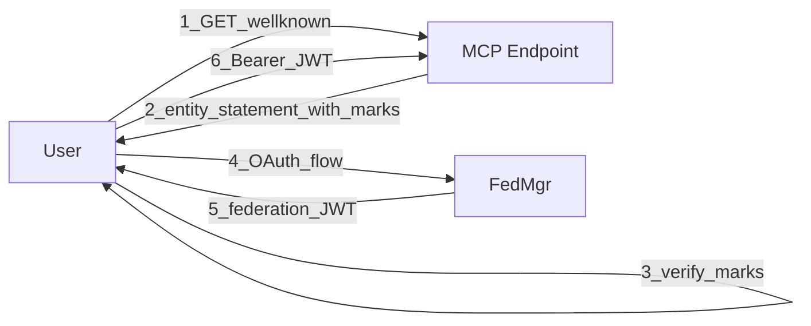
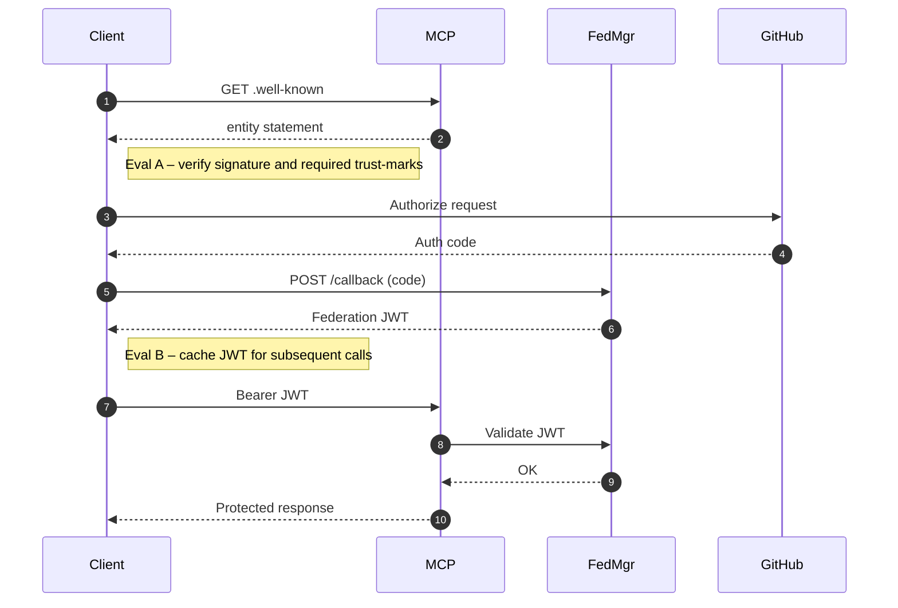
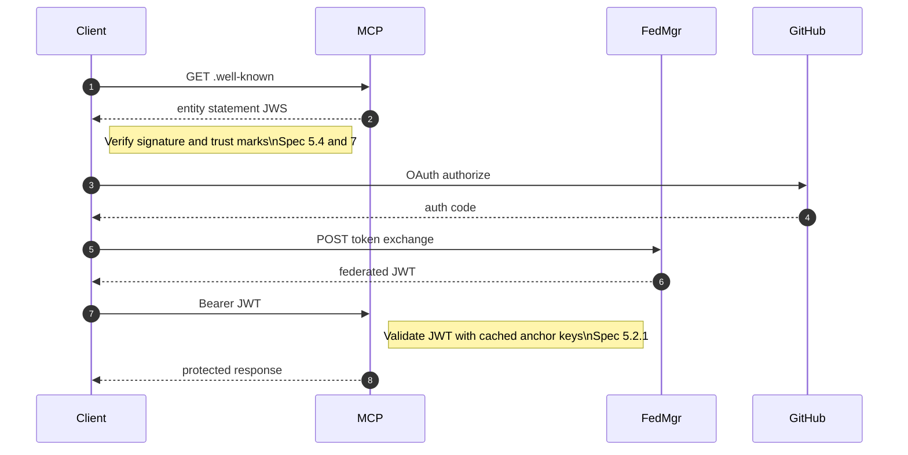
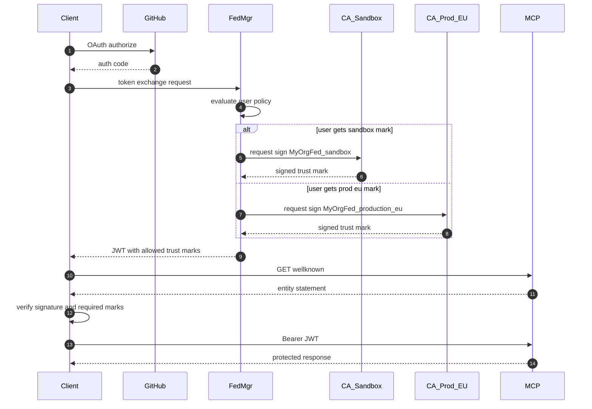
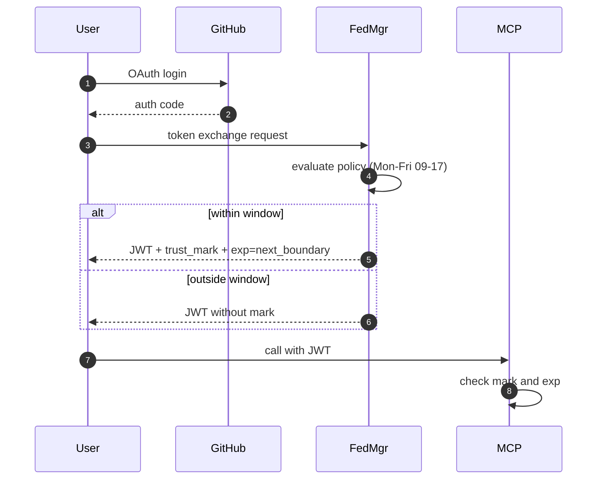
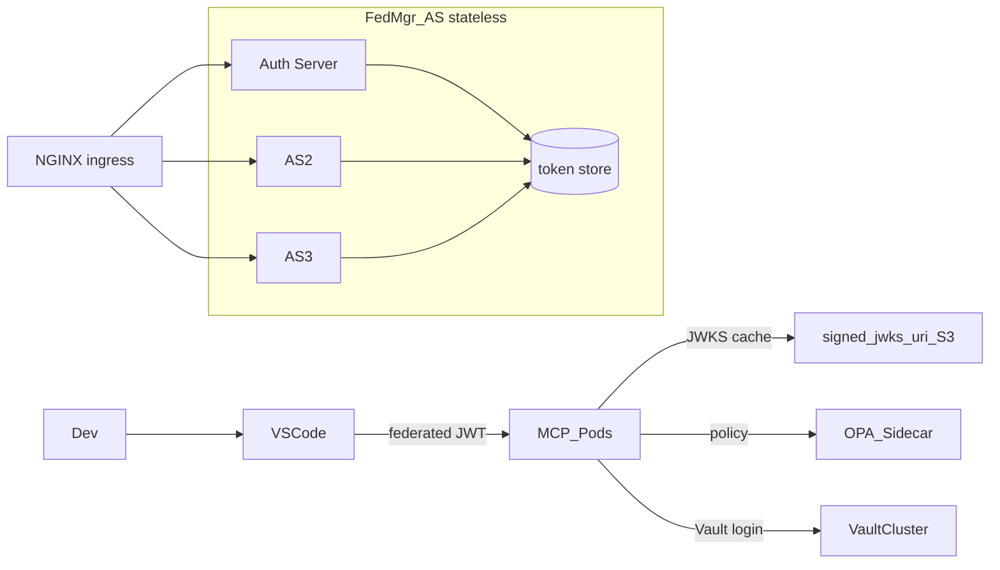

# Developer Guide: Container User, Permissions, and Volume Mounts

This guide provides best practices and considerations for handling user permissions and mounted volumes in Docker and Kubernetes environments for the `fedmgr` project.

---

## 1. Container User and Permissions in Docker

- **Non-root User:**  
  Always run your application as a non-root user inside the container for security.  
  Example in Dockerfile:
  ```dockerfile
  RUN addgroup -S appgroup && adduser -S appuser -G appgroup
  USER appuser
  ```

- **Directory Creation and Ownership:**  
  Create necessary directories and set ownership **before** switching to the non-root user:
  ```dockerfile
  RUN mkdir -p /usr/src/app/federations /usr/src/app/data \
      && chown -R appuser:appgroup /usr/src/app/federations /usr/src/app/data
  USER appuser
  ```

- **Mounted Volumes:**  
  If you mount a host directory (e.g., with `-v /host/path:/usr/src/app/federations`), the files/directories retain their host ownership and permissions.  
  If `appuser` inside the container does **not** have permission to write to the mounted directory, you will get permission errors.

### How to Avoid Permission Problems

- **Match UID/GID:**  
  Make sure the UID/GID of `appuser` in the container matches the owner of the directory on the host.  
  Example:
  ```dockerfile
  RUN addgroup -g 1001 appgroup && adduser -u 1001 -G appgroup -S appuser
  ```
  On the host:
  ```bash
  sudo chown -R 1001:1001 /host/path
  ```

- **Set Host Permissions:**  
  Alternatively, make the host directory world-writable (less secure, not recommended for production):
  ```bash
  chmod -R a+rwx /host/path
  ```

- **Use Docker Compose `user:` Option:**  
  Run the container as a specific UID/GID that matches the host directory owner:
  ```yaml
  services:
    federation-admin:
      user: "1001:1001"
  ```

---

## 2. Kubernetes Workloads: Abstracting Permissions

- **Use `securityContext`:**  
  In your Kubernetes manifest, set the `securityContext` for your Pod or container to match the UID/GID of `appuser`:
  ```yaml
  securityContext:
    runAsUser: 1000      # UID of appuser
    runAsGroup: 1000     # GID of appgroup
    fsGroup: 1000        # Ensures mounted volumes are owned by this group
  ```

  - `runAsUser`/`runAsGroup`: Ensures the container runs as the specified user/group.
  - `fsGroup`: Ensures all files in mounted volumes are owned by this group, so your appuser can read/write.

- **No Need to `chown` in Dockerfile for Mounted Volumes:**  
  Kubernetes will handle it via `fsGroup`.  
  Keep your Dockerfile clean and portable, focusing only on app logic.

- **Document Required UID/GID:**  
  Document the required UID/GID for your appuser (e.g., 1000) so cluster admins can set up volumes accordingly.

---

## 3. Summary Table

| Scenario                                 | Will it work? | Notes                                      |
|-------------------------------------------|:-------------:|---------------------------------------------|
| Host dir owned by root, container as appuser | ❌            | Permission denied for writes                |
| Host dir owned by same UID as appuser     | ✅            | Works fine                                  |
| Host dir world-writable                  | ✅            | Works, but less secure                      |
| Use `user:` in Compose to match host UID  | ✅            | Works if UID matches host dir owner         |
| Use `fsGroup` in Kubernetes               | ✅            | Abstracts permissions for PVCs              |

---

## 4. Best Practices

- Do privileged operations (like `mkdir` and `chown`) as root in the Dockerfile, before switching to `USER appuser`.
- Switch to `USER appuser` only after those steps.
- For Kubernetes, use `securityContext` with `runAsUser` and `fsGroup` to abstract away host-specific permissions.
- Avoid hardcoding `chown/chmod` for mount points in the Dockerfile; let Kubernetes handle it.
- Document the required UID/GID for your images.

---

**References:**  
- [Kubernetes securityContext docs](https://kubernetes.io/docs/tasks/configure-pod-container/security-context/)
- [Dockerfile best practices](https://docs.docker.com/develop/develop-images/dockerfile_best-practices/)


# Client validation flow



# Client flow as sequence diagram - not quite right


# client sequence diagram - improved flow, Client gets the trust marks first.


# client sequent diagram - user is limited to trust marks at JWT minting time



# Time bound trust mark assignment


# High performance arch

