# Developer Guide: Container User, Permissions, and Volume Mounts

This guide provides best practices and considerations for handling user permissions and mounted volumes in Docker and Kubernetes environments for the `fedmgr` project.

---

## 1. Container User and Permissions in Docker

- **Non-root User:**  
  Always run your application as a non-root user inside the container for security.  
  Example in Dockerfile:
  ```dockerfile
  RUN addgroup -S appgroup && adduser -S appuser -G appgroup
  USER appuser
  ```

- **Directory Creation and Ownership:**  
  Create necessary directories and set ownership **before** switching to the non-root user:
  ```dockerfile
  RUN mkdir -p /usr/src/app/federations /usr/src/app/data \
      && chown -R appuser:appgroup /usr/src/app/federations /usr/src/app/data
  USER appuser
  ```

- **Mounted Volumes:**  
  If you mount a host directory (e.g., with `-v /host/path:/usr/src/app/federations`), the files/directories retain their host ownership and permissions.  
  If `appuser` inside the container does **not** have permission to write to the mounted directory, you will get permission errors.

### How to Avoid Permission Problems

- **Match UID/GID:**  
  Make sure the UID/GID of `appuser` in the container matches the owner of the directory on the host.  
  Example:
  ```dockerfile
  RUN addgroup -g 1001 appgroup && adduser -u 1001 -G appgroup -S appuser
  ```
  On the host:
  ```bash
  sudo chown -R 1001:1001 /host/path
  ```

- **Set Host Permissions:**  
  Alternatively, make the host directory world-writable (less secure, not recommended for production):
  ```bash
  chmod -R a+rwx /host/path
  ```

- **Use Docker Compose `user:` Option:**  
  Run the container as a specific UID/GID that matches the host directory owner:
  ```yaml
  services:
    federation-admin:
      user: "1001:1001"
  ```

---

## 2. Kubernetes Workloads: Abstracting Permissions

- **Use `securityContext`:**  
  In your Kubernetes manifest, set the `securityContext` for your Pod or container to match the UID/GID of `appuser`:
  ```yaml
  securityContext:
    runAsUser: 1000      # UID of appuser
    runAsGroup: 1000     # GID of appgroup
    fsGroup: 1000        # Ensures mounted volumes are owned by this group
  ```

  - `runAsUser`/`runAsGroup`: Ensures the container runs as the specified user/group.
  - `fsGroup`: Ensures all files in mounted volumes are owned by this group, so your appuser can read/write.

- **No Need to `chown` in Dockerfile for Mounted Volumes:**  
  Kubernetes will handle it via `fsGroup`.  
  Keep your Dockerfile clean and portable, focusing only on app logic.

- **Document Required UID/GID:**  
  Document the required UID/GID for your appuser (e.g., 1000) so cluster admins can set up volumes accordingly.

---

## 3. Summary Table

| Scenario                                 | Will it work? | Notes                                      |
|-------------------------------------------|:-------------:|---------------------------------------------|
| Host dir owned by root, container as appuser | ❌            | Permission denied for writes                |
| Host dir owned by same UID as appuser     | ✅            | Works fine                                  |
| Host dir world-writable                  | ✅            | Works, but less secure                      |
| Use `user:` in Compose to match host UID  | ✅            | Works if UID matches host dir owner         |
| Use `fsGroup` in Kubernetes               | ✅            | Abstracts permissions for PVCs              |

---

## 4. Best Practices

- Do privileged operations (like `mkdir` and `chown`) as root in the Dockerfile, before switching to `USER appuser`.
- Switch to `USER appuser` only after those steps.
- For Kubernetes, use `securityContext` with `runAsUser` and `fsGroup` to abstract away host-specific permissions.
- Avoid hardcoding `chown/chmod` for mount points in the Dockerfile; let Kubernetes handle it.
- Document the required UID/GID for your images.

---

**References:**  
- [Kubernetes securityContext docs](https://kubernetes.io/docs/tasks/configure-pod-container/security-context/)
- [Dockerfile best practices](https://docs.docker.com/develop/develop-images/dockerfile_best-practices/)


# Client validation flow

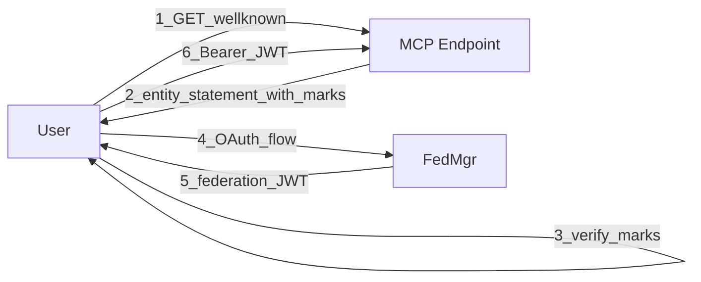

# Client flow as sequence diagram - not quite right
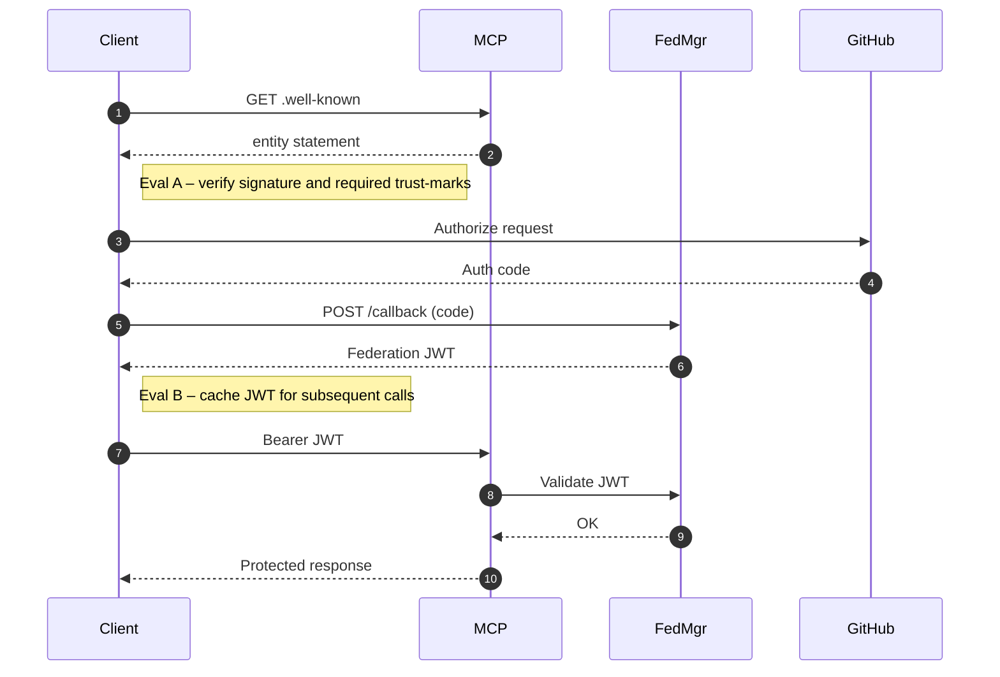

# client sequence diagram - improved flow, Client gets the trust marks first.
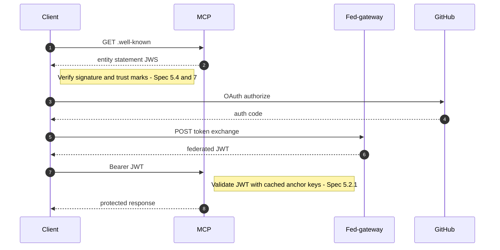

# client sequent diagram - user is limited to trust marks at JWT minting time

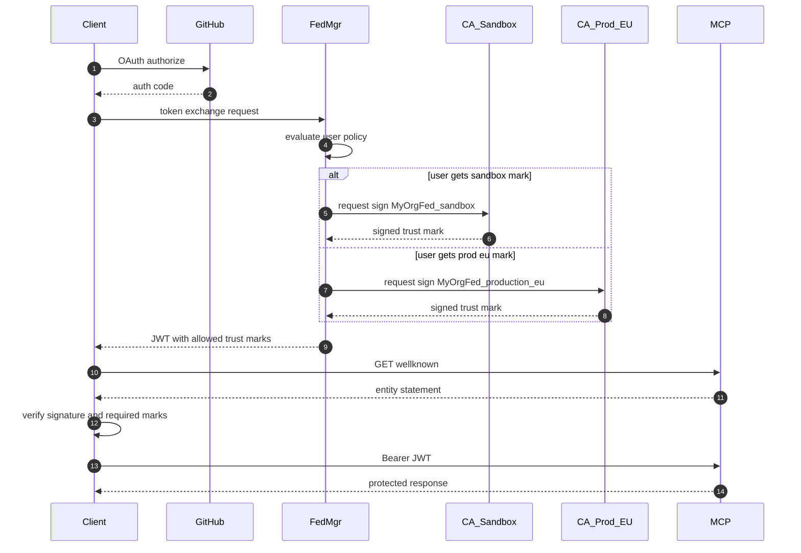

# Time bound trust mark assignment
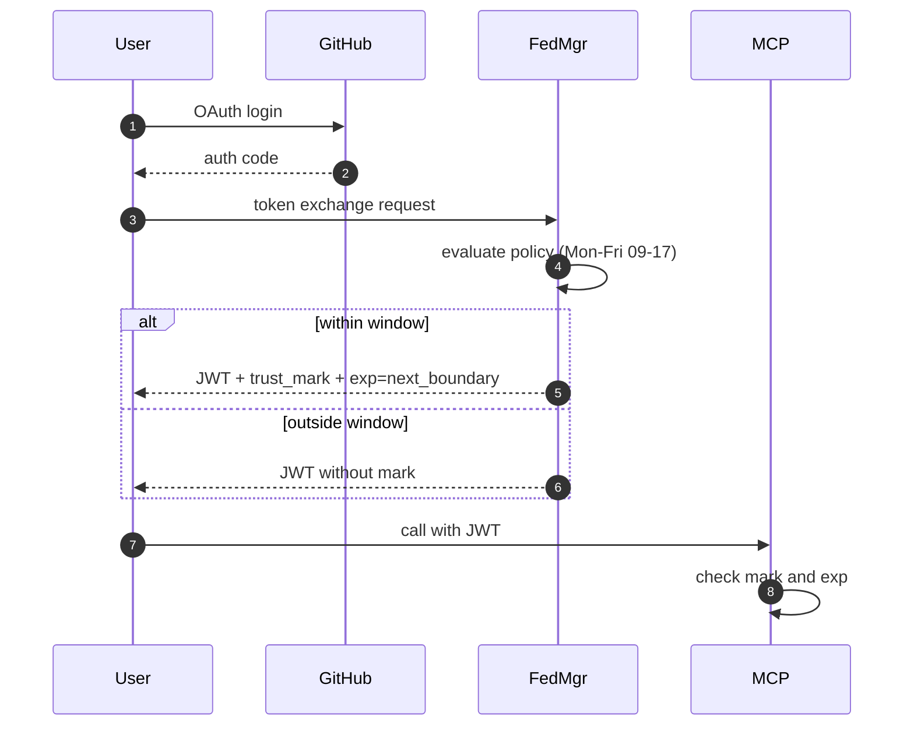


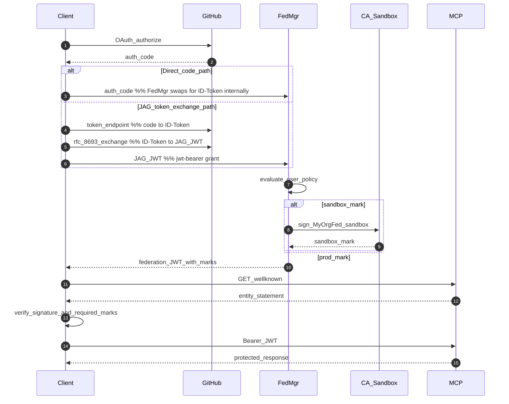


# High performance arch
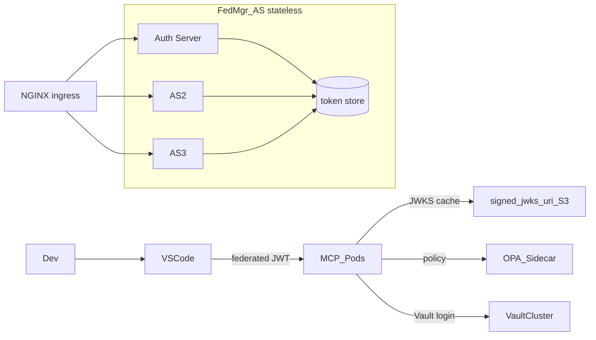

## full flow sept 11, 2025

```mermaid
sequenceDiagram
autonumber
participant UA as User Agent (Browser)
participant RP as OrgB-RPmcp (RP)
participant FRP as FedResolver-RP (fedmgr @ OrgB)
participant OP as OrgA-OP (OP)
participant FOP as FedResolver-OP (fedmgr @ OrgA)
participant TA as TAOmega (Trust Anchor)

%% ------------------------------------------------------------
%% 0) OUT-OF-BAND SETUP (publish once; refreshed by TTL)
%% ------------------------------------------------------------
note over OP,TA: Prepublished artifacts (federation layer):
note over OP: Entity Configuration (EC) at\nhttps://op.orga.example/.well-known/openid-federation\n• iss==sub==https://op.orga.example\n• jwks (federation keys), metadata (OP), authority_hints: [https://ta.fedomega.example]
note over RP: Entity Configuration (EC) at\nhttps://rp.orgb.example/.well-known/openid-federation\n• iss==sub==https://rp.orgb.example\n• jwks (federation keys), metadata (RP), authority_hints: [https://ta.fedomega.example]
note over TA: TAOmega EC at\nhttps://ta.fedomega.example/.well-known/openid-federation\n• iss==sub==https://ta.fedomega.example\n• jwks (anchor keys), federation policy

%% ------------------------------------------------------------
%% 1) USER BEGINS SIGN-IN FLOW AT RP
%% ------------------------------------------------------------
UA->>RP: Navigate to protected resource (requires sign-in)
note over RP: RP chooses OrgA-OP as login provider (preconfigured or via discovery)

%% ------------------------------------------------------------
%% 2) RP PRE-FLIGHT: RESOLVE & TRUST OP (Federation layer)
%% ------------------------------------------------------------
RP->>FRP: Resolve OP entity: "https://op.orga.example"
FRP->>OP: GET /.well-known/openid-federation (OP EC)
FRP->>TA: GET Entity Statement(s) about OP (chain links)
FRP->>FRP: Validate signatures, iss/sub, exp; build trust chain
FRP->>FRP: Enforce policy (required trust marks, profiles, constraints)
FRP-->>RP: Decision {allow|deny}, chain_hash, vetted OP metadata, TTL
note over RP,FRP: Cache decision/metadata until TTL expiry.\nIf deny → abort here with user-friendly error.

%% ------------------------------------------------------------
%% 3) IF NEEDED: FEDERATION-BASED DYNAMIC CLIENT REGISTRATION
%%    (OP validates RP’s federation posture; may auto-issue client_id)
%% ------------------------------------------------------------
alt Client not yet registered at OP
  RP->>OP: Registration request (per OIDC-Fed; includes RP entity_id)
  OP->>FOP: Resolve RP entity: "https://rp.orgb.example"
  FOP->>RP: GET RP EC
  FOP->>TA: GET Entity Statement(s) about RP (chain links)
  FOP->>FOP: Validate chain; apply metadata policy (constraints/overrides)
  FOP-->>OP: Decision {allow|deny}, vetted RP metadata
  alt Allow
    OP-->>RP: Registration response (client_id, client metadata)
    note over OP,RP: OP stores registration; RP stores client_id & endpoints.\nKeys for federation artifacts remain separate from runtime OIDC keys.
  else Deny
    OP-->>RP: Registration denied (policy reasons)
    RP-->>UA: Stop flow (cannot use this OP under current policy)
  end
else Already registered
  note over OP,RP: Skip registration; RP uses stored client_id and OP endpoints.
end

%% ------------------------------------------------------------
%% 4) RUNTIME OIDC: AUTHORIZATION CODE + PKCE SIGN-IN
%%    (Tokens are runtime artifacts; do not carry trust marks)
%% ------------------------------------------------------------
RP->>UA: Redirect to OP /authorize (client_id, redirect_uri, scope=openid, state, nonce, code_challenge, ...)
note over UA,OP: (Optional) PAR: RP first posts request to OP PAR endpoint; OP returns request_uri used at /authorize

UA->>OP: GET /authorize (Auth Code + PKCE request)
OP->>UA: Authenticate user (OrgA identity: login + MFA as required)
OP-->>UA: Redirect back to RP with code & state

UA->>RP: Return with code & state
RP->>OP: POST /token (code, code_verifier, client_auth per registration)
OP-->>RP: 200 OK { id_token, access_token, token_type, expires_in, ... }

%% ------------------------------------------------------------
%% 5) RP VALIDATES ID TOKEN (client-facing JWT)
%% ------------------------------------------------------------
RP->>FRP: (If JWKS not cached) fetch/confirm OP JWKS from vetted metadata
RP->>RP: Validate id_token: iss(https://op.orga.example), aud(client_id), azp (if multi-aud), exp/iat, nonce, sig
note over RP: Access token is opaque to client; only RS should interpret it.\nIf RP calls /userinfo, it will pass the access token to OP’s UserInfo endpoint.

%% ------------------------------------------------------------
%% 6) (OPTIONAL) CALL USERINFO OR AN API (RS)
%% ------------------------------------------------------------
alt Call OP UserInfo
  RP->>OP: GET /userinfo (Authorization: Bearer <access_token>)
  OP-->>RP: User claims (per granted scopes)
else Call other API (e.g., an MCP Server)
  note over RP,FRP: Repeat federation pre-flight for that API entity_id.\nNo required trust marks → do not connect.
end

%% ------------------------------------------------------------
%% 7) HOUSEKEEPING / GOVERNANCE
%% ------------------------------------------------------------
note over RP,FRP: Persist chain_hash, decision, and expiry for audit.\nRe-resolve on TTL expiry or key rotation.\nKeep federation keys separate from runtime OIDC signing keys.
```


## OpenID Federation in 15 sec

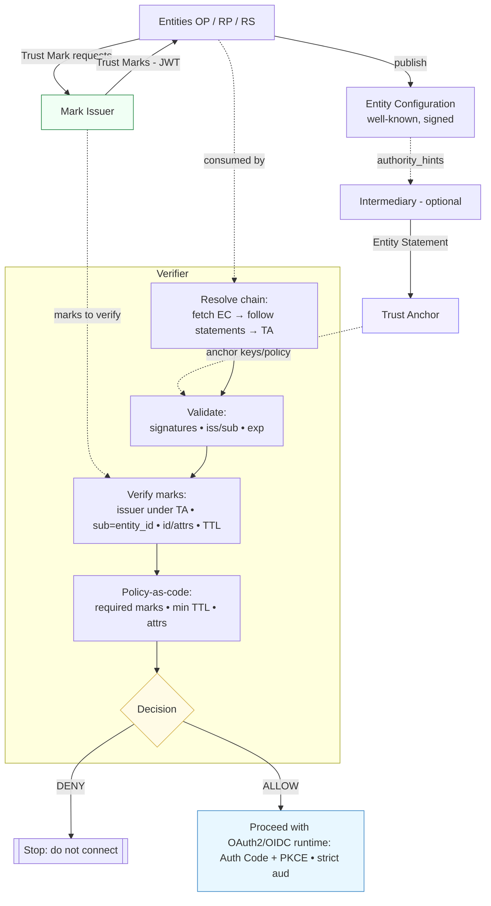

## 15 sec OpenID Fed but WSD

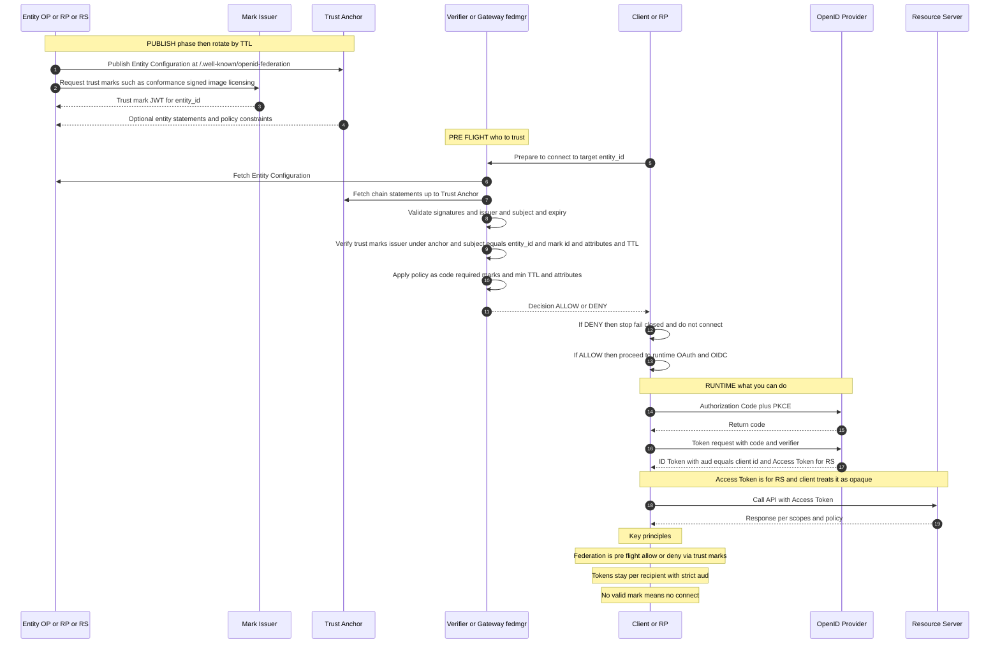


## Reviewed Sept18: The end state flow of MCP with OpenID Fed flow

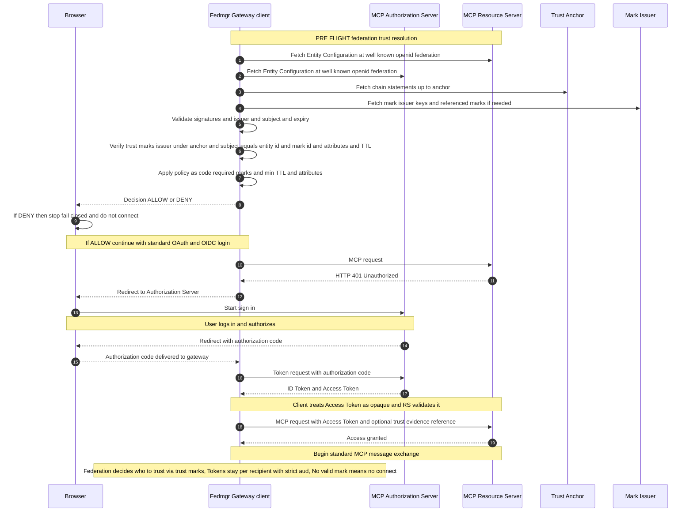

### Reasoning

In OpenID Federation, only entities that actually participate in federation are expected to publish /.well-known/openid-federation with a self-signed Entity Configuration where iss equals sub equals the entity_id.

Your Authorization Server only belongs in the federation pre flight if it is itself a federated OP or OAuth AS entity. If it is a plain OAuth AS, you do not fetch /.well-known/openid-federation from it; you use normal OIDC discovery later.

The Resource Server can be a federated entity such as an oauth resource. If it is not, you can still evaluate trust marks about that RS entity id that are issued under the anchor, but you would not expect to fetch an EC from it.

Correct validation order in pre flight is resolve chain via authority hints, verify EC signatures and exp, verify mark signatures under the anchor, confirm mark subject equals the entity id you intend to connect to, then apply policy. Only if ALLOW do you proceed to standard OAuth and OIDC.

### Conclusion/Recommendations

Treat AS federation discovery as optional and only when the AS participates as a federated OP or OAuth AS.

Keep RS discovery optional too; you may evaluate marks about RS even if the RS does not host an EC.

Make the ALLOW or DENY decision before the first RS request where possible. If you keep the initial 401 trigger, still perform pre flight first to avoid contacting an untrusted endpoint.


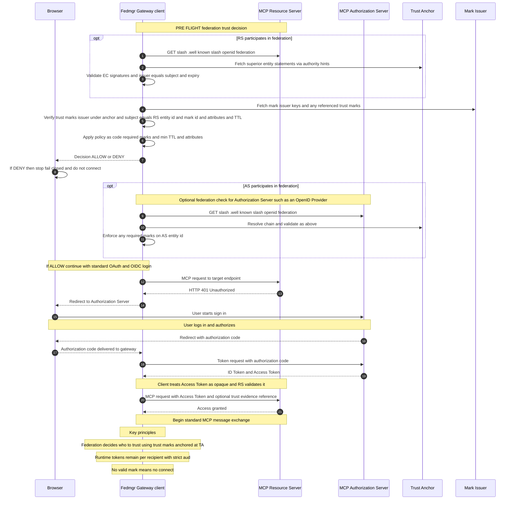

## Regular OpenID Federation path  

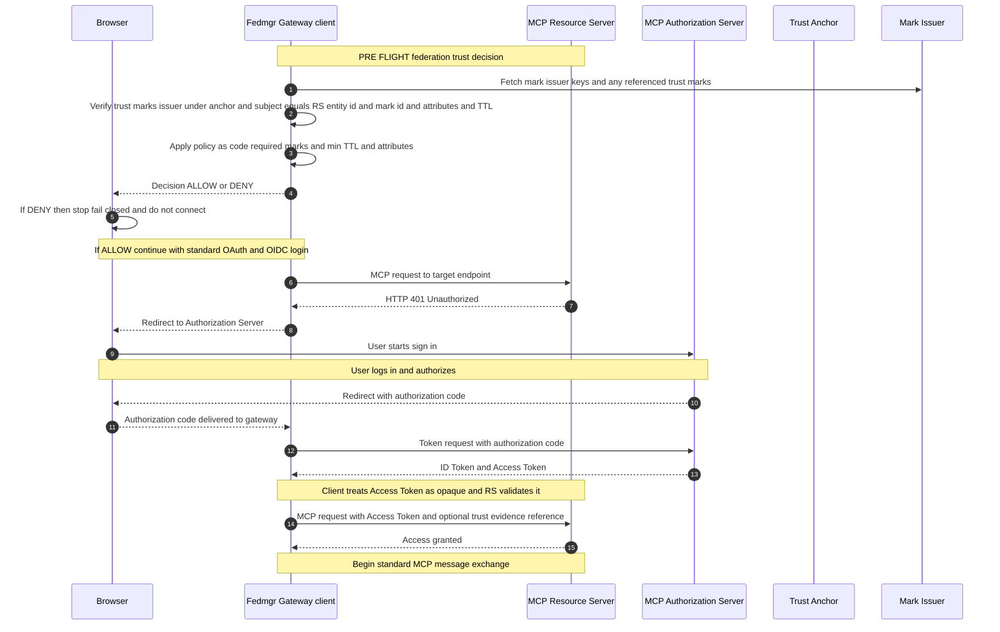

### Key principles: 
Fed decides who to trust using trust marks anchored at TA, 
Runtime tokens remain per recipient with strict aud, 
No valid mark means no connect
