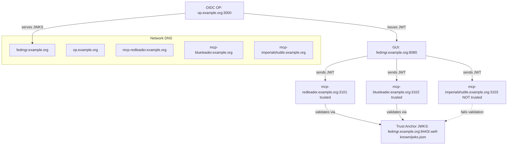
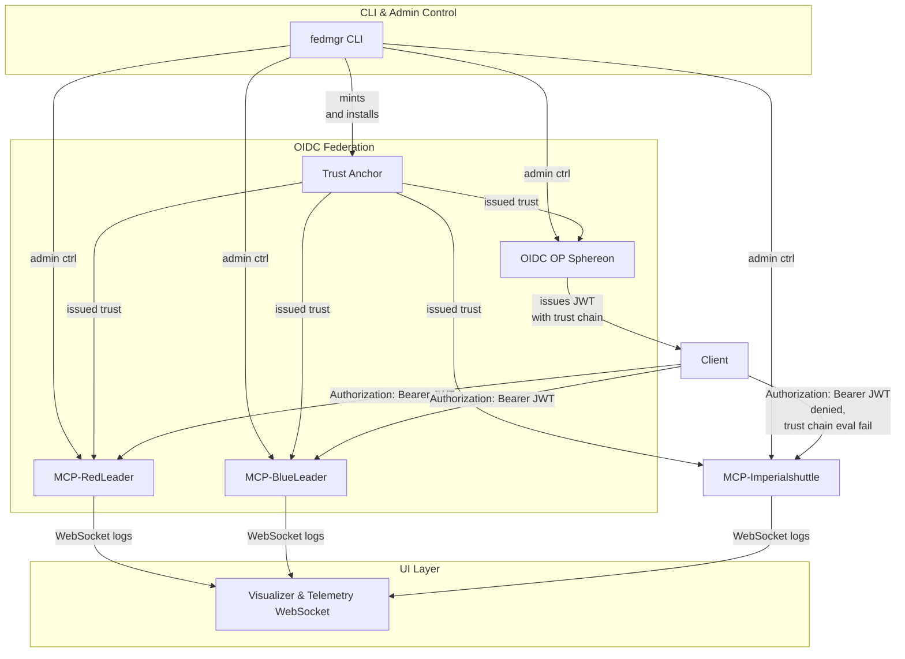

# 🏛️ Project Architecture: `fedmgr`

This architecture powers a scalable demonstration of OpenID Federation for securing trust relationships between OIDC Providers (OPs) and Model Context Protocol (MCP) servers. The system is modular, observable, and driven by a declarative CLI and reusable NPM libraries.

---

## 🔧 Components

### `@letsfederate/fedmgr` (CLI & Library)
- CLI for bootstrapping federations
- Also usable as a library to dynamically generate config
- Generates:
  - Trust anchors
  - Entity configuration files
  - JWKS keysets (served via `.well-known/jwks.json` URLs)
  - `docker-compose.generated.yml`

### `@letsfederate/mcp-core` (MCP Runtime)
- Express-based server implementing:
  - `GET /whoami` – show user identity from JWT
  - `GET /showtrust` – show current trust configuration
  - `GET /stats` – usage analytics
  - `GET /status` – health + sync state
- Includes JWT validator with OpenID Federation trust chain logic

---

## 📦 Deployment Pattern

An updated deployment pattern iterating from prior design:

### Build-time:
1. `scripts/build-npm.sh`:
   - Builds and packs `mcp-core`, `fedmgr`
   - Runs lint and tests
   - NPM build Hygiene
     - npm pack, npm publish, dry-run, sanity tests per package

2. `scripts/setup.sh`:
   - Validates prerequisites (Docker, jq)

   - Generates `docker-compose.generated.yml`
   - Adds OP + 3 default MCPs listed in as mcp-redleader.example.org, mcp-blueleader.example.org, mcp-imperialshuttle.example.org
   - Binds volumes from `./config/` for metadata and JWKS
   - Each MCP has dynamic configuration volume (./config/mcp-X)
   - Updates `/etc/hosts` entries for all these to be 127.0.0.1:
     - `fedmgr.example.org`
     - `op.example.org`
     - `mcp-redleader.example.org`, `mcp-blueleader.example.org`, `mcp-imperialshuttle.example.org`
   - Configures federation membership
   - sets up a shared docker network
3. Agent Integration Hints
- VSCode/GitHub Copilot agent can connect to MCPs

- Can uses /whoami, /showtrust, /stats, /status endpoints


---

## 🤖 CLI Actions

```bash
fedmgr create fed <federation-name>          # Bootstrap a new trust anchor and federation (isCA:true)
fedmgr create mcp <federation-name>          #spawn new MCP, optionally register with a federation
fedmgr list entities                         # List all federated entities
fedmgr visualize                             # Show trust graph and entity telemetry
fedmgr call <mcp> --token <jwt>              # Simulate a call to an MCP with an OIDC token

fedmgr join entity <federation-name>       # Register OP in federation
fedmgr remove op <federation-name>       # Register OP in federation

fedmgr help                   # Emit connection + trust metadata
fedmgr destroy fed <federation-name>      # Rotate keys and tear down topology
```

---

## 🧠 Runtimes

### Instances Logical Architecture



### Control Planes




### Trust Anchor + JWKS Configuration Generation
🔹 Goals:

    Bootstrap trust anchors with unique keypairs

    Create signed Entity Statements for:

        Trust Anchor itself

        Each OP and MCP joining the federation

    Generate and serve JWKS for each entity via .well-known/

    Ensure all files are in predictable paths for docker-compose.generated.yml to mount

### Recommended File Layout per Federation
```bash
/config/
  fed-alpha/
    trust-anchor/
      jwks.json
      entity-statement.json
    op/
      op.example.org/
        jwks.json
        entity-configuration.json
    mcps/
      mcp1.example.org/
        jwks.json
        entity-configuration.json
      mcp2.example.org/
        ...
  the_empire/
    ...
```
### Sample implementation
Use node-jose or jose package to generate 
```ts
import { generateKeyPair, exportJWK, SignJWT } from 'jose'

async function createKeyPairAndJWKS(name: string) {
  const { publicKey, privateKey } = await generateKeyPair('RS256')

  const jwkPub = await exportJWK(publicKey)
  const jwkPriv = await exportJWK(privateKey)

  const jwks = { keys: [jwkPub] }

  await fs.promises.writeFile(`config/${name}/jwks.json`, JSON.stringify(jwks, null, 2))

  return { publicKey, privateKey }
}

async function signEntityStatement(metadata, issuer, subject, privateKey) {
  return await new SignJWT({
    metadata,
    iss: issuer,
    sub: subject,
    iat: Math.floor(Date.now() / 1000),
    exp: Math.floor(Date.now() / 1000) + 3600
  })
  .setProtectedHeader({ alg: 'RS256' })
  .sign(privateKey)
}
```
### For each entity

- jwks.json → served at https://<host>/.well-known/jwks.json

- entity-configuration.json → served at https://<host>/.well-known/openid-federation

---

## 🔐 JWT Trust Flow

Each MCP:
- Receives a Bearer token in `Authorization` header
- Validates:
  - Signature against JWKS from issuer (served via `.well-known/jwks.json`)
  - Issuer against federation trust anchor
  - `exp`, `aud`, `scope`, `acr`, `trust_mark`
- Rejects any token from unknown or misconfigured issuers


---

## 📊 Telemetry

Each MCP:
- Emits logs over WebSocket
- Reports to `public/index.html` dashboard
- Logs include:
  - Token validation events
  - User call counts
  - Trust events

---

## 💡 Multiple Federation / Overlap Support

MCPs can join multiple federations by supporting:
- Multiple trust anchors
- Multiple `/.well-known/openid-federation` entries
- Dynamic trust mark filtering

Example:
- `imperialShuttle` could be in both `fed-rebelalliance` and `the_empire` or neither

---

## 🚀 Future Extensibility

- Replace Sphereon with:
  - Keycloak + OIDC Fed Plugin
  - Shibboleth OIDC Extension
- Enable `letsfederate.org` as a federation broker service
- Add real-time trust mark introspection APIs

