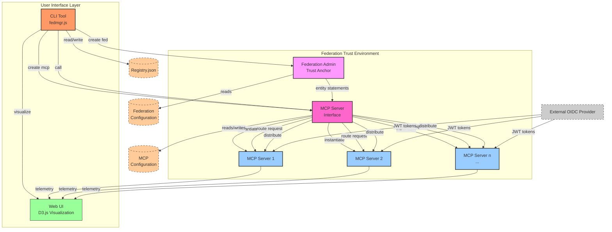

# fedmgr Architecture Documentation

## System Architecture Overview

Based on the analysis of the codebase, this document outlines the system components, data flows, integration points, and design considerations for the fedmgr project.

## 1. Architecture Diagram

## 2. Component Descriptions

### 2.1 Core Components

#### 2.1.1 CLI Tool (fedmgr.js)
- **Purpose**: Command-line interface for managing federations and MCP instances
- **Responsibilities**:
  - Bootstrap federation trust anchors
  - Request creation of MCP instances via the MCP Server Interface
  - List registered entities
  - Route JWT-authenticated calls to MCPs via the interface
  - Launch visualization interface
- **Integration Points**:
  - Reads/writes to registry.json to track federations and MCPs
  - Spawns Federation Admin server process
  - Interacts with MCP Server Interface for MCP management

#### 2.1.2 MCP Server Interface
- **Purpose**: Abstraction layer for managing MCP instances
- **Responsibilities**:
  - Create and initialize MCP instances
  - Route requests to appropriate MCP instances
  - Manage MCP lifecycle (start, stop, restart)
  - Handle configuration and key management for MCPs
- **Integration Points**:
  - Invoked by CLI tool
  - Creates and manages MCP server processes
  - Distributes entity statements from Federation Admin to MCPs
  - Manages MCP configuration files

#### 2.1.3 Federation Admin Server (federation-admin.js)
- **Purpose**: Acts as a trust anchor for the federation
- **Responsibilities**:
  - Serves entity configuration at /.well-known/openid-federation
  - Provides federation metadata and trust chains
  - Establishes the root of trust for the federation
- **Integration Points**:
  - Reads entity configuration and private keys from filesystem
  - Exposes REST endpoints for federation metadata
  - Communicates with MCP Server Interface for entity distribution

#### 2.1.4 MCP Server (mcp-server.js)
- **Purpose**: Simulates a Master Control Program that validates tokens
- **Responsibilities**:
  - Validates JWT tokens using federation trust policies
  - Emits telemetry data via WebSockets
  - Simulates protected API endpoints
- **Integration Points**:
  - Exposes REST API endpoints
  - Provides WebSocket endpoint for telemetry
  - Reads configuration from filesystem
  - Receives entity statements from MCP Server Interface

#### 2.1.5 Web Interface (index.html, server.js)
- **Purpose**: Provides visualization and interaction with the system
- **Responsibilities**:
  - Renders D3.js trust graph visualization
  - Displays telemetry data in real-time
  - Provides command interface for fedmgr
- **Integration Points**:
  - Connects to MCP WebSocket endpoints for telemetry
  - Renders federation trust relationships

### 2.2 Data Stores

#### 2.2.1 Registry (registry.json)
- **Purpose**: Tracks registered federations and MCP instances
- **Structure**:
  - List of federation names
  - Map of MCP names to port numbers
- **Access Patterns**:
  - Read by CLI to list entities
  - Updated by CLI when creating federations
  - Updated by MCP Server Interface when creating MCPs

#### 2.2.2 Federation Configuration
- **Purpose**: Stores federation entity configuration
- **Structure**:
  - Entity ID (sub)
  - Metadata (organization_name, contacts, endpoints)
  - Authority hints
  - JWKS (JSON Web Key Set)
- **Access Patterns**:
  - Created by CLI or bootstrap script
  - Read by Federation Admin server

#### 2.2.3 MCP Configuration
- **Purpose**: Stores MCP entity configuration
- **Structure**:
  - Entity ID (sub)
  - Metadata (organization_name, contacts, endpoints)
  - Authority hints (pointing to Federation Admin)
  - JWKS (JSON Web Key Set)
- **Access Patterns**:
  - Created by MCP Server Interface
  - Read by MCP server instances

## 3. Data Flows

### 3.1 Federation Bootstrap Flow
1. User executes `fedmgr create fed <name>`
2. CLI generates keypair for trust anchor
3. CLI creates entity configuration file
4. CLI updates registry.json with federation name
5. CLI starts Federation Admin server

### 3.2 MCP Creation Flow
1. User executes `fedmgr create mcp <name>`
2. CLI invokes MCP Server Interface with creation request
3. MCP Server Interface generates keypair for MCP
4. MCP Server Interface creates entity configuration file with authority hint to Federation Admin
5. MCP Server Interface updates registry.json with MCP name and port
6. MCP Server Interface starts MCP server process

### 3.3 Token Validation Flow
1. User executes `fedmgr call <mcp> --token <jwt>`
2. CLI looks up MCP in registry.json
3. CLI routes request to MCP Server Interface
4. MCP Server Interface forwards request to appropriate MCP
5. MCP validates token (simulated)
6. MCP emits telemetry via WebSocket
7. Web UI receives and displays telemetry

### 3.4 Visualization Flow
1. User executes `fedmgr visualize`
2. Web server starts (if not already running)
3. Browser opens to visualization page
4. Web UI connects to MCP WebSocket endpoints
5. Web UI receives telemetry and updates D3.js visualization

## 4. Integration Points

### 4.1 CLI to MCP Server Interface
- **Interface**: Function calls or IPC
- **Protocol**: JSON
- **Purpose**: Create and manage MCP instances

### 4.2 CLI to Registry
- **Interface**: File I/O
- **Protocol**: JSON
- **Purpose**: Track federations and MCPs

### 4.3 Federation Admin to MCP Server Interface
- **Interface**: HTTP REST
- **Protocol**: OpenID Federation 1.0
- **Purpose**: Provide trust metadata and entity statements

### 4.4 MCP Server Interface to MCPs
- **Interface**: Process management and configuration
- **Protocol**: File I/O, IPC
- **Purpose**: Create, configure, and manage MCP instances

### 4.5 MCPs to Web UI
- **Interface**: WebSocket
- **Protocol**: JSON
- **Purpose**: Stream telemetry data for visualization

### 4.6 External OIDC to MCPs
- **Interface**: HTTP REST
- **Protocol**: OIDC/OAuth 2.0
- **Purpose**: Provide JWT tokens for authentication

## 5. Security Considerations

### 5.1 Key Management
- RSA keypairs are generated for each federation and MCP
- Private keys are stored in the filesystem (for demo purposes)
- In production, keys should be stored in a secure key management system
- MCP Server Interface should manage key distribution securely

### 5.2 Token Validation
- Currently simulated, but should implement full JWT validation
- Should verify signature, expiration, issuer, and audience
- Should validate against federation trust chain

### 5.3 Trust Establishment
- Federation Admin serves as trust anchor
- MCPs trust the Federation Admin via authority hints
- Trust chains should be validated during token validation
- MCP Server Interface should verify trust relationships

## 6. Extensibility Points

### 6.1 Additional Federation Types
- The system can be extended to support multiple federation types
- New federation types can be added by implementing appropriate entity configuration
- MCP Server Interface can be extended to support different federation protocols

### 6.2 OIDC Provider Integration
- External OIDC providers can be integrated
- Federation Admin can act as a broker for external OIDC providers
- MCP Server Interface can route tokens from different OIDC providers

### 6.3 Telemetry Extensions
- Additional telemetry data can be added to the WebSocket stream
- Web UI can be extended to display additional telemetry data
- MCP Server Interface can aggregate telemetry from multiple MCPs

### 6.4 Visualization Enhancements
- D3.js visualization can be enhanced to show more details
- Additional visualization types can be added
- Dynamic scaling to handle large numbers of MCPs

## 7. Deployment Considerations

### 7.1 Development Environment
- Local development using Node.js
- Federation and MCP instances run on different ports
- Registry.json tracks port assignments
- MCP Server Interface manages port allocation

### 7.2 Production Deployment
- Federation Admin and MCPs should be deployed as separate services
- MCP Server Interface could be deployed as a separate service or sidecar
- WebSocket connections need to be properly routed
- Keys should be stored securely

## 8. Future Enhancements

### 8.1 OIDC OP Proxying
- Allow local OIDC OP to act as a broker
- Receive ID Tokens from external providers
- Mint local JWTs into the federation
- MCP Server Interface could handle token transformation

### 8.2 Federation Replay/Simulation
- Record and replay federation interactions
- Simulate various trust scenarios
- MCP Server Interface could orchestrate simulation scenarios

### 8.3 Multi-tenant Sandboxing
- Support multiple isolated federation environments
- Allow testing of cross-federation scenarios
- MCP Server Interface could manage tenant isolation

### 8.4 JWE Encryption
- Add support for encrypted JWTs
- Implement assurance tagging
- MCP Server Interface could handle encryption/decryption

## 9. Conclusion

The fedmgr architecture provides a flexible and extensible framework for simulating federated identity environments. The modular design allows for easy extension and customization, while the CLI and visualization interfaces provide intuitive ways to interact with the system.

The introduction of an MCP Server Interface improves separation of concerns by abstracting MCP management from the CLI tool. This allows the CLI to focus on user interaction while the interface handles the complexities of MCP lifecycle management, configuration, and communication.

The architecture follows best practices for separation of concerns, with clear boundaries between components and well-defined integration points. The use of standard protocols (OpenID Federation, OIDC, WebSockets) ensures interoperability and ease of integration with external systems.